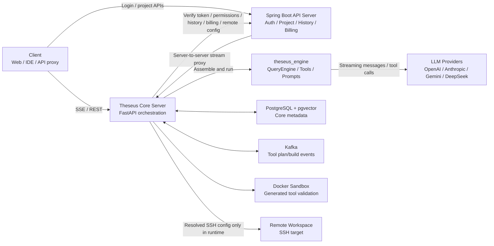
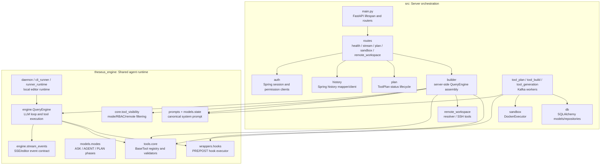
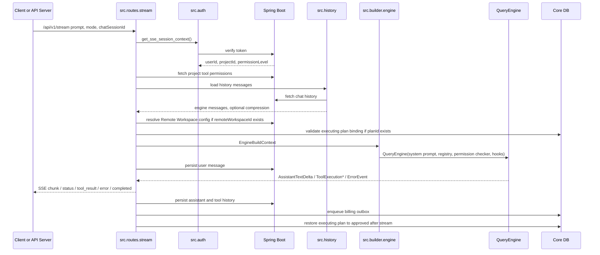
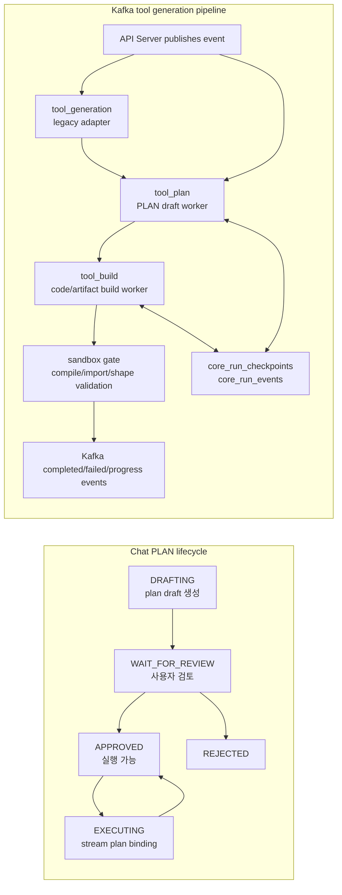
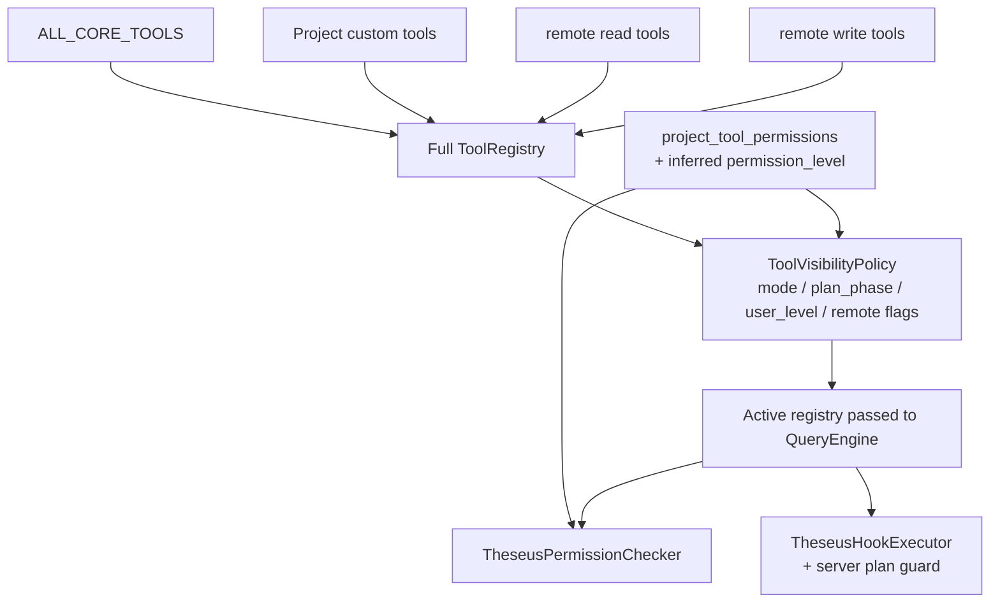
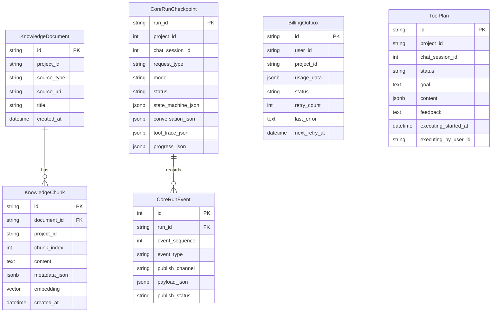
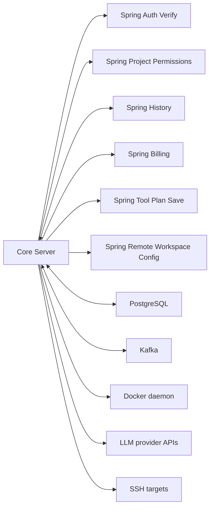
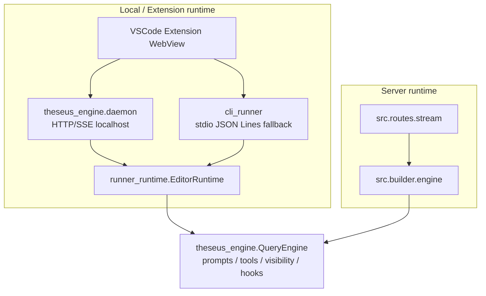

# Theseus Core Server 아키텍처와 관계도

작성일: 2026-05-15

이 문서는 `backend/theseus-core-server`의 현재 구현을 기준으로 Core Server의
역할, 내부 모듈 경계, 외부 시스템 연동, 주요 실행 흐름을 한눈에 볼 수 있게
정리한다. 세부 설계 문서가 아니라, 개발자가 코드 탐색을 시작할 때 참조하는
구조 지도에 가깝다.

## 1. 시스템 경계

Theseus Core Server는 Spring Boot API Server와 클라이언트 사이에서 AI
에이전트 실행을 담당하는 Python/FastAPI 서비스다. 사용자, 프로젝트, 권한,
대화 이력, 과금의 source of truth는 Spring Boot가 담당하고, Core Server는
검증된 세션 컨텍스트를 받아 `theseus_engine` 런타임을 조립해 실행한다.

핵심 경계는 다음과 같다.

| 영역 | 현재 책임 | 대표 파일 |
|---|---|---|
| FastAPI 앱 | lifespan, DB 초기화, scheduler, Kafka consumer, route 등록 | `src/main.py` |
| 인증/권한 | Spring token 검증, project tool permission 조회, dev/test mock auth | `src/auth/*` |
| 스트리밍 | SSE 요청 처리, history 로드/저장, engine context 구성, billing outbox 적재 | `src/routes/stream.py` |
| 서버용 engine assembly | Core tool/custom tool/remote tool registry 구성, mode별 visibility, server guard | `src/builder/engine.py` |
| 에이전트 런타임 | QueryEngine, StreamEvent, prompt, RBAC, permission, hooks, tool 실행 | `theseus_engine/*` |
| plan 영속화 | PLAN 상태 전환, 실행 중 plan binding 검증, stream 이후 복구 | `src/plan/*` |
| tool 생성 worker | Kafka 기반 PLAN draft, build, legacy adapter, checkpoint/event republish | `src/tool_plan/*`, `src/tool_build/*`, `src/tool_generation/*` |
| sandbox | 생성된 tool code 실행/검증 격리 | `src/sandbox/*` |
| Remote Workspace | API resolver, SSH connector, remote read/write tool 생성 | `src/remote_workspace/*` |
| Knowledge/RAG | 서버 스코프 지식 문서/chunk 저장과 검색 | `src/knowledge/*`, `src/db/models.py` |

## 2. 레이어 구조

현재 코드는 `src` 서버 오케스트레이션 계층과 `theseus_engine` 런타임 계층을
분리한다. `src`는 서버 전용 인증, 영속화, 외부 시스템 계약을 소유하고,
`theseus_engine`은 CLI/TUI/Extension/local daemon/server가 함께 쓰는 실행
코어를 소유한다.

### `src`와 `theseus_engine`의 기준

| 구분 | `src`에 둔다 | `theseus_engine`에 둔다 |
|---|---|---|
| 서버 계약 | FastAPI route, Spring internal API, Kafka topic, DB repository | 없음. 서버를 직접 import하지 않도록 유지 |
| 런타임 조립 | 서버 전용 context, plan guard, remote resolver metadata | local/daemon/CLI/TUI 공통 `setup_engine` |
| 도구 정책 | 프로젝트 permission, remote write 허용값, 서버 sandbox gate | BaseTool, ToolRegistry, visibility, validator, repair policy |
| 프롬프트 | 서버 worker adapter와 runtime reminder | canonical prompt source of truth |
| 상태/이력 | Spring history projection, ToolPlan DB status, billing outbox | in-memory conversation, StreamEvent, local session runtime |

## 3. SSE 요청 흐름

`GET /api/v1/stream`과 `POST /api/v1/stream`은 같은 내부 조립 경로를 탄다.
POST는 `remoteWorkspaceId` 같은 민감한 입력을 URL query에 남기지 않기 위한
server-to-server proxy용 경로다.

요청 단위 핵심 데이터는 `EngineBuildContext`에 모인다.

| 필드 | 출처 | 사용처 |
|---|---|---|
| `user_level` | Spring session context | RBAC permission checker |
| `project_tool_permissions` | Spring project permission API | Tool visibility와 실행 권한 |
| `mode`, `plan_phase` | request mode, `planId` | ASK/AGENT/PLAN tool 노출 정책 |
| `history_messages` | Spring history API | QueryEngine multi-turn context |
| `plan_id`, `plan_content` | Core DB `tool_plans` | 실행 중 plan guard, prompt context |
| `remote_workspace` | Spring remote workspace resolver | remote tool registry와 runtime key |

## 4. PLAN과 Tool 생성 흐름

Core Server에는 사용자 대화용 PLAN 모드와 서버 worker용 tool plan/build
pipeline이 함께 있다. 사용자-facing runtime mode는 `ASK`, `AGENT`, `PLAN`이고,
Kafka 계약명인 `ToolPlan`은 생성형 tool pipeline 내부 용어다.

중요한 제약은 다음과 같다.

| 제약 | 의미 |
|---|---|
| `create_tool` guard | 서버 stream에서는 실행 중인 plan과 project/user/chat session binding이 있어야 `create_tool`을 실행할 수 있다. |
| PLAN draft validation | tool 생성/운영 점검 성격의 draft는 `execution_spec`과 Core validation mode를 통과해야 저장/응답된다. |
| legacy coexistence | `tool_generation`은 legacy Kafka 이벤트를 신규 `tool_plan` 흐름으로 넘기는 adapter다. 운영에서는 중복 발행 여부를 주의해야 한다. |
| checkpoint/event table | tool plan/build worker는 run 단위 lease, event sequence, pending event republish를 위해 Core DB를 사용한다. |

## 5. Tool Registry와 권한 관계

Tool 노출은 단순히 prompt에서 설명을 빼는 수준이 아니라, registry 자체를
mode/phase/RBAC/remote context 기준으로 필터링한다.

대표 정책은 다음과 같다.

| 상황 | 노출/실행 정책 |
|---|---|
| ASK | 읽기 중심 도구만 노출한다. |
| PLAN drafting/review | 조사와 계획 수립에 필요한 read-only 도구 중심으로 제한한다. |
| PLAN executing | 승인된 plan binding이 있을 때 실행 도구와 `create_tool` 경로가 열린다. |
| AGENT | 사용자 RBAC와 project permission 기준으로 일반 실행 도구를 노출한다. |
| Remote Workspace | `remoteWorkspaceId`가 있을 때 remote read 도구를 추가하고, write/command는 resolver 결과의 `allowWriteExecution`이 참일 때만 노출한다. |
| Server stream | permission prompt 기본 정책은 거부이며, 위험 도구는 서버 guard와 hook/validator를 통과해야 한다. |

## 6. 데이터 관계도

Core DB는 Spring Boot의 전체 서비스 DB를 대체하지 않는다. Core 자체 실행에
필요한 outbox, plan, knowledge, worker checkpoint/event만 저장한다.

| 테이블 | 소유 책임 |
|---|---|
| `knowledge_documents`, `knowledge_chunks` | 프로젝트 스코프 지식 문서와 pgvector chunk |
| `billing_outbox` | stream 완료 후 사용량을 Spring Billing API로 전달하기 위한 outbox |
| `tool_plans` | chat session별 PLAN lifecycle과 실행 중 binding |
| `core_run_checkpoints`, `core_run_events` | Kafka worker run lease, checkpoint, event publish/republish |

## 7. 외부 연동 관계

| 연동 | 설정 | 방향 | 비고 |
|---|---|---|---|
| Spring auth | `SPRING_BOOT_AUTH_VERIFY_URL` | Core -> Spring | Bearer token 검증 |
| Spring permission | `SPRING_BOOT_PROJECT_PERMISSIONS_URL` | Core -> Spring | project/user별 tool permission |
| Spring history | `SPRING_BOOT_INTERNAL_HISTORY_MESSAGES_URL` | Core <-> Spring | multi-turn history load/save |
| Spring billing | `SPRING_BOOT_BILLING_USAGE_URL` | Core -> Spring | billing outbox scheduler가 전송 |
| Remote Workspace resolver | `SPRING_BOOT_REMOTE_WORKSPACE_CONFIG_URL` | Core -> Spring | `remoteWorkspaceId`로 SSH config resolve |
| PostgreSQL | `CORE_POSTGRES_*` | Core <-> DB | Core-local metadata와 pgvector |
| Kafka | `CORE_KAFKA_*`, `KAFKA_TOPIC_*` | Core <-> Kafka | tool plan/build/generation worker |
| Docker | `DOCKER_HOST`, `SANDBOX_*` | Core -> Docker | generated tool sandbox gate |
| LLM provider | `THESEUS_MODEL`, provider API keys | Engine -> Provider | streaming messages/tool calls |

## 8. Local Runtime과 Server Runtime

같은 `theseus_engine`을 서버와 로컬 런타임이 공유하지만 조립 위치와 주변
책임이 다르다.

| 구분 | Local daemon / CLI / TUI | Core Server |
|---|---|---|
| 실행 위치 | 사용자 PC 또는 IDE extension host | Core Server 프로세스 |
| 인증/권한 | local defaults 또는 optional server config | Spring session/project permission |
| 이력 | `.theseus_sessions` 등 local artifact 중심 | Spring history API |
| 과금 | local stats/report_usage optional | billing outbox 필수 경로 |
| 도구 승인 | IDE/TUI permission prompt 가능 | server stream 기본 거부 정책 |
| Workspace | local cwd | 서버 process cwd 또는 remote workspace context |

## 9. 현재 이행기 주의 지점

| 주의 지점 | 현재 상태 | 개발 시 확인할 파일 |
|---|---|---|
| 서버 builder와 local builder 차이 | `src/builder/engine.py`가 서버용 조립을 직접 수행하고, `theseus_engine/core/engine_builder.py`는 local/daemon 계열 최신 조립을 담당한다. 공통화 작업 전에는 어느 경로가 실행되는지 먼저 확인해야 한다. | `src/builder/engine.py`, `theseus_engine/core/engine_builder.py` |
| RAG 경로 이중화 | 서버 기본은 `src/knowledge`이며, standalone engine RAG tool은 명시 opt-in 성격이다. 같은 DB schema를 바라볼 때 충돌 가능성이 있다. | `src/knowledge/*`, `theseus_engine/rag/*` |
| legacy tool_generation | legacy Kafka contract가 신규 `tool_plan` planner로 위임된다. 운영에서 legacy/new event가 동시에 발행되면 중복 처리를 조심해야 한다. | `src/tool_generation/processor.py`, `src/tool_plan/processor.py` |
| Remote Workspace secret | stream/Kafka/history/debug dump에는 원본 SSH config를 싣지 않고 redacted metadata와 runtime key만 남겨야 한다. | `src/remote_workspace/*`, `src/builder/engine.py` |
| PLAN 실행 guard | `create_tool`은 실행 중인 plan, project, user, chat session context가 맞아야 한다. UI 상태와 DB 상태가 어긋나면 실행이 막힌다. | `src/plan/service.py`, `src/builder/engine.py` |
| history tool projection | tool start/result는 Spring history에 `SYSTEM_NOTICE` JSON으로 저장되고 다음 턴 assistant context로 projection된다. | `src/history/service.py`, `src/history/mapper.py` |

## 10. 코드 탐색 시작점

| 알고 싶은 것 | 먼저 볼 파일 |
|---|---|
| 서버가 어떻게 뜨는지 | `src/main.py` |
| SSE 요청이 어떻게 engine으로 이어지는지 | `src/routes/stream.py` |
| 서버 stream에서 어떤 tool이 노출되는지 | `src/builder/engine.py`, `theseus_engine/core/tool_visibility.py` |
| QueryEngine tool loop와 StreamEvent | `theseus_engine/engine/query_engine.py`, `theseus_engine/engine/stream_events.py` |
| PLAN 상태 전환과 실행 binding | `src/plan/service.py`, `src/routes/plan.py` |
| Kafka tool plan/build worker | `src/tool_plan/processor.py`, `src/tool_build/processor.py` |
| Generated tool sandbox gate | `src/sandbox/*`, `src/tool_build/builder.py` |
| Remote Workspace 연결 | `src/remote_workspace/resolver.py`, `src/remote_workspace/*_primitives.py` |
| 설정과 외부 URL | `src/config.py`, `.env.example` |

