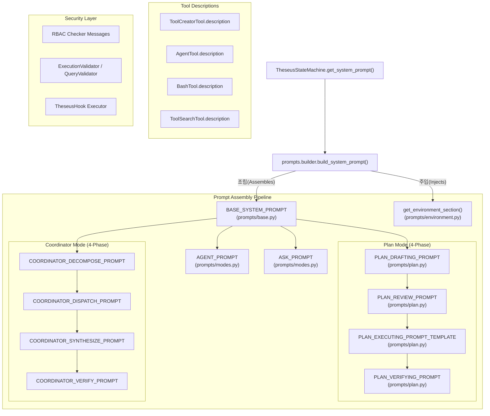

# 테세우스 프롬프트 아키텍처 맵 (Theseus Prompt Architecture Map)

이 문서는 테세우스 고유의 모든 프롬프트 파일, 그 위치, 역할 및 간단한 설명을 카탈로그화한 것입니다. 이 프롬프트들은 AI 에이전트의 페르소나, 가드레일, 그리고 운영 지능을 종합적으로 정의합니다.

> **최종 업데이트**: 2026-05-18 — runtime mode reminder, PLAN draft execution spec validation mode, validation/failure feedback, code editing safety, remote/local worktree boundary, project tool artifact path, sandbox dependency image 반영

---

## 1. 핵심 시스템 프롬프트 (Core System Prompts)

### 전체 구조

시스템 프롬프트의 본문과 조립 로직은 `theseus_engine/prompts/` 패키지가 canonical source of truth입니다. `theseus_engine/models/state.py`는 runtime state machine façade와 기존 import 호환만 담당합니다.

분리 이유:

- 상태 머신과 prompt 본문 결합을 줄여 mode/phase 상태 변경과 문구 수정을 독립적으로 검토할 수 있게 합니다.
- CLI, TUI, VSCode Extension, Core Server가 계속 같은 canonical prompt builder를 사용하게 합니다.
- prompt 수정 위치를 좁혀 `state.py` 대형 모놀리스 변경으로 인한 회귀 위험을 줄입니다.

### 파일별 책임

| 위치 | 책임 | 수정 기준 |
|---|---|---|
| `theseus_engine/models/modes.py` | `AgentMode`, `PlanPhase`, `CoordinatorPhase`, `MODE_DESCRIPTIONS` 정의 | mode/phase enum 또는 표시 레이블을 바꿀 때 수정합니다. |
| `theseus_engine/models/state.py` | `TheseusStateMachine` 상태 전환, plan/coordinator phase 속성, 기존 import re-export | 상태 전환 동작 또는 public façade만 수정합니다. prompt 본문은 넣지 않습니다. |
| `theseus_engine/prompts/base.py` | 모든 모드에 공통 적용되는 base prompt | Theseus 정체성, 공통 보안/작업/언어 규칙을 바꿀 때 수정합니다. |
| `theseus_engine/prompts/environment.py` | OS, shell, cwd, Python, Git branch 등 runtime environment section | 환경 정보 주입 항목이나 비용이 큰 감지 로직을 바꿀 때 수정합니다. |
| `theseus_engine/prompts/capabilities.py` | tool/RBAC/validation/web/create_tool/code editing safety capability prompt와 조건부 렌더링 | tool schema 기반 capability 조건, generated custom tool 보안 규칙, 파일 수정 안전 규칙 노출을 바꿀 때 수정합니다. |
| `theseus_engine/prompts/modes.py` | ASK/AGENT mode prompt | 일반 채팅/자율 실행 모드 규칙을 바꿀 때 수정합니다. |
| `theseus_engine/prompts/plan.py` | PLAN Drafting/Review/Executing/Verifying prompt | PLAN JSON schema, 승인/실행/검증 흐름, create_tool 실행 지침을 바꿀 때 수정합니다. |
| `theseus_engine/prompts/coordinator.py` | Coordinator Decompose/Dispatch/Synthesize/Verify prompt | 병렬 sub-agent orchestration 지침을 바꿀 때 수정합니다. |
| `theseus_engine/prompts/builder.py` | `build_system_prompt()` 최종 조립 함수 | 섹션 순서, mode/phase prompt 선택, 신규 mode/phase 연결을 바꿀 때 수정합니다. |
| `theseus_engine/core/mode_context.py` | mode 전환 runtime reminder 생성 | CLI/TUI/Extension/local daemon/server stream에서 다음 턴에만 주입할 현재 mode assertion 문구를 바꿀 때 수정합니다. |
| `src/builder/system_prompt.py` | Core Server adapter | 서버 worker가 `theseus_engine` canonical builder를 호출하도록 mode/phase 문자열을 변환합니다. |

새 권장 import:

```python
from theseus_engine.models.modes import AgentMode, PlanPhase, CoordinatorPhase
from theseus_engine.prompts.builder import build_system_prompt
```

호환 import:

```python
from theseus_engine.models.state import AgentMode, PlanPhase, CoordinatorPhase
from theseus_engine.models.state import TheseusStateMachine
```

기존 runtime 호출부는 계속 아래 경로를 사용해도 됩니다.

```python
state_machine.get_system_prompt(
    available_tools=active_tool_names,
    runtime_reminders=runtime_reminders,
)
```

신규로 직접 조립해야 하는 서버/테스트 코드는 `build_system_prompt()`를 사용해도 됩니다. 단, 일반 runtime은 `TheseusStateMachine.get_system_prompt()`를 우선 사용해 mode/phase state와 prompt가 어긋나지 않게 합니다.

#### 1.1 글로벌 프롬프트

| 프롬프트 상수 | 역할 | 설명 |
|---|---|---|
| `BASE_SYSTEM_PROMPT` | `prompts/base.py` | 테세우스의 정체성, 작업/코드 규칙, 보안 기본값, 에러 루프 방지, 컨텍스트 관리. **모든** 모드에 공통 적용됩니다. |
| `get_environment_section()` | `prompts/environment.py` | OS, 아키텍처, 셸, CWD, Python 버전, Git 브랜치 등을 동적으로 감지하여 프롬프트에 주입합니다. |
| `PromptCapabilities` | `prompts/capabilities.py` | 현재 tool schema, mode/phase, runtime reminder를 바탕으로 어떤 capability 프롬프트를 붙일지 결정합니다. |
| `build_mode_runtime_reminders()` | `core/mode_context.py` | mode selector/slash/server request가 지정한 현재 runtime mode를 다음 LLM 턴에 1회만 명시합니다. 사용자 history에는 저장하지 않습니다. |
| `MODE_DESCRIPTIONS` | `models/modes.py` | TUI/로그에 표시되는 사람이 읽을 수 있는 모드 설명. |

#### 1.1.1 Capability 프롬프트

| 프롬프트 상수 | 주입 조건 | 역할 |
|---|---|---|
| `TOOL_USE_CAPABILITY_PROMPT` | 현재 schema에 하나 이상의 tool이 있을 때 | 존재하는 tool만 호출하고 전용 tool을 우선하도록 안내 |
| `RBAC_PERMISSION_PROMPT` | tool capability가 있을 때 | 권한 필터링 사실과 권한 밖 요청 대응 지침 |
| `VALIDATION_CAPABILITY_PROMPT` | tool capability가 있을 때 | validator block 결과를 읽고 수정 후 재시도하는 지침 |
| `CODE_EDITING_SAFETY_PROMPT` | `write_file`, `edit_file`, `remote_write_file`, `remote_edit_file` 중 하나가 있을 때 | 파일 수정 전 읽기, invariant 보존, `edit_file` 우선, 기존 파일 `write_file` 덮어쓰기 제한, 검증 실패 후 재시도/보고 기준 |
| `REMOTE_LOCAL_REPORT_PROMPT` | `local_write_report` 또는 Remote Workspace 관련 tool이 현재 schema에 있을 때 | Remote Workspace 대상은 `remote_*`, Core/local worktree 대상은 local tool로 처리하도록 경계를 안내 |
| `WEB_CAPABILITY_PROMPT` | `web_search`, `web_fetch`, `deep_research` 중 하나가 있을 때 | 외부 명세 확인이 필요한 작업의 web research 기준 |
| `CREATE_TOOL_CAPABILITY_PROMPT` | `create_tool`이 현재 schema에 있을 때 | Theseus custom tool 생성 코드 규약과 2턴 호출 규칙 |

#### 1.1.2 Code editing safety

파일 수정 안전 규칙은 prompt 지침만으로 끝나지 않고 runtime tool 경계에서 함께 강제됩니다.

| 위치 | 역할 | 주의점 |
|---|---|---|
| `theseus_engine/prompts/capabilities.py::CODE_EDITING_SAFETY_PROMPT` | LLM이 파일 수정 도구를 호출하기 전 지켜야 할 규칙을 system prompt에 주입 | 단순 주석/한 줄 수정/설정 변경은 `edit_file`을 우선 사용하고, 기존 파일 전체 덮어쓰기는 명시적 사유 없이는 금지합니다. |
| `theseus_engine/tools/core/edit_safety.py` | diff, 위험도, Python AST, import/class/function/config key 보존 여부를 검증 | 사용자-facing prompt는 아니지만 prompt 규칙과 같은 정책의 실행 경계입니다. 규칙 변경 시 prompt와 함께 갱신합니다. |
| `theseus_engine/tools/core/file_edit_tool.py` / `file_write_tool.py` | local 파일 수정 전후 검증, 실패 시 차단/rollback, `safetyReport` metadata 반환 | 성공 메시지는 변경 요약과 안전 검증 결과를 포함해야 합니다. |
| `src/remote_workspace/write_primitives.py` | Remote Workspace 파일 쓰기/수정에 같은 검증 적용 | 원격 secret은 prompt에 넣지 않고, 원격 파일 content 기준으로 안전 검증 후 SFTP write를 수행합니다. |

정책 요약:

- `edit_file`은 `old_str`가 기본적으로 정확히 한 번만 매칭되어야 합니다.
- `write_file`은 신규 파일 생성이 기본이며, 기존 파일 덮어쓰기는 `allow_overwrite=true`와 `overwrite_reason`이 있어야 합니다.
- 도구가 명시적으로 받은 `preserve_patterns`와 QueryEngine의 최근 사용자 goal에서 추출한 “바꾸지 말라” 계열 invariant를 함께 보존합니다.
- 고위험 파일(`config.py`, `.env`, `application.yml`, Docker/Jenkins/Nginx 파일 등)은 import/class/function/config key 삭제를 차단합니다.
- Python 파일은 `ast.parse()` 기반 문법 검증을 통과해야 합니다.
- 안전 검증 실패는 `ToolResult(is_error=True)`로 반환되어 다음 LLM 턴에서 원인 설명과 더 작은 패치 재시도를 유도합니다.

#### 1.1.3 Remote Workspace + local worktree tool boundary

Remote Workspace가 선택된 요청에서도 Core/local worktree 도구를 무조건 숨기지 않습니다. 대신 현재 mode와 `user_level >= permission_level` 기준을 유지하면서, 대상이 Remote Workspace인지 Core/local worktree인지 명확히 구분합니다.

| 위치 | 역할 | 주의점 |
|---|---|---|
| `theseus_engine/core/tool_visibility.py` | remote context에서도 local 도구를 RBAC와 mode 기준으로 노출 | ASK와 PLAN Drafting/Review는 read-only 중심입니다. AGENT 또는 승인된 PLAN Executing에서는 local write/edit도 사용자 등급에 따라 노출될 수 있습니다. |
| `theseus_engine/tools/core/local_report_tool.py` | remote 분석 결과를 Core worktree의 report artifact로 저장 | `.md`, `.json`, `.txt`만 허용하고, `reports/` 또는 `.theseus/reports/` 하위만 허용합니다. 기존 파일 덮어쓰기는 명시적 overwrite 사유가 필요합니다. |
| `theseus_engine/prompts/capabilities.py::REMOTE_LOCAL_REPORT_PROMPT` | LLM에게 remote 분석은 `remote_*`, Core/local worktree 작업은 local tool을 사용하도록 안내 | 대상이 불명확하면 도구 호출 전에 remote/local 중 무엇인지 확인해야 합니다. |
| `src/builder/engine.py` | 서버 `/stream` registry 조립 시 env와 mode/phase를 보고 `local_write_report` 노출 여부를 결정 | `THESEUS_REMOTE_LOCAL_REPORT_WRITE_ENABLED=false`면 remote AGENT에서도 숨깁니다. 저장 루트는 `THESEUS_LOCAL_REPORT_ROOT`를 metadata로 전달합니다. |

정책 요약:

- Remote Workspace의 파일/로그/리소스 읽기는 `remote_read_file`, `remote_glob`, `remote_grep`, `remote_tail_log`, `remote_check_*`를 사용합니다.
- Core/local worktree의 파일 읽기/수정은 `read_file`, `glob`, `grep`, `write_file`, `edit_file` 같은 local tool을 사용합니다.
- ASK와 PLAN Drafting/Review는 local/remote 읽기 중심이며 write/edit/bash는 제외됩니다.
- AGENT와 승인된 PLAN Executing은 현재 사용자 등급이 허용하는 local tool을 사용할 수 있습니다.
- Remote Workspace 쓰기/명령은 별도 `allowWriteExecution=true`가 있어야만 `remote_write_file`, `remote_edit_file`, `remote_run_command`가 노출됩니다.
- remote 분석 결과를 local report artifact로 저장할 때는 `local_write_report`를 우선 사용합니다.

#### 1.2 모드별 프롬프트

| 프롬프트 상수 | 모드 | 역할 | 주요 규칙 |
|---|---|---|---|
| `ASK_PROMPT` | Ask | 읽기 전용 질문/답변 | 현재 schema에 있는 read-only 도구는 사용할 수 있습니다. 상태 변경, 파일 쓰기/수정, shell 실행, tool 생성은 금지합니다. |
| `AGENT_PROMPT` | Agent | 자율 실행 | 도구 자유 사용. 모드 전환 가이드(Plan/Ask 제안) 포함. `create_tool` 금지. |

#### 1.3 Plan 모드 프롬프트 (4단계 파이프라인)

| 프롬프트 상수 | 단계 | 역할 | 주요 규칙 |
|---|---|---|---|
| `PLAN_DRAFTING_PROMPT` | Drafting | 코드베이스 조사 + 제안서 작성 | **읽기 도구 허용** (`read_file`, `glob`, `grep`, 읽기 전용 bash). Research→Analyze→Plan 3단계 워크플로우. **Tier 분류** (T1 Quick Win / T2 Strategic / T3 Architecture). 확장된 JSON 스키마: `context{problem_analysis, affected_files, risks}`, `tasks[]{tier, problem, solution, target_files, integration_points, expected_effect}`, `verification{test_commands, manual_checks, success_criteria}`, `action_plan{immediate, sequential_dependencies, estimated_turns}`. 운영 점검/Remote Workspace/generated tool 요청은 `execution_spec`를 포함해야 합니다. |
| `PLAN_REVIEW_PROMPT` | WaitForReview | 반복 승인 루프 | 사용자의 approve/edit/질문/cancel 처리. 수정 시 변경점 표시 + 업데이트된 계획 재제시. 승인까지 반복. 조사 위해 읽기 도구 사용 가능. |
| `PLAN_EXECUTING_PROMPT_TEMPLATE` | Executing | 승인된 계획 실행 | Tier/action_plan 기반 실행 순서 결정. 즉시 도구 호출 강제. `create_tool` 2턴 규칙. 진행 상황 보고(`[Progress] task-N complete (N/total)`). 예상외 복잡도 발견 시 중단 의무. |
| `PLAN_VERIFYING_PROMPT` | Verifying | 실행 결과 검증 | 테스트 실행, 변경 파일 리뷰, 회귀 확인, 계획 완료율 확인. 구조화된 검증 결과 출력 (Tests/Changes/Issues/Plan completion). 사소한 수정만 허용, 근본적 문제 시 Drafting 회귀 권고. |

PLAN 실행/검증 완료는 하위 호환을 위해 기존 문자열 marker도 유지합니다. local runner는 해당 marker를 감지하면 `PlanPhaseTransitionRequested` 구조화 이벤트를 함께 발행해 editor/daemon 클라이언트가 assistant prose를 직접 파싱하지 않도록 합니다.

#### 1.3.1 PLAN draft execution spec

운영 서버 점검, Remote Workspace 진단, Docker/API/log/resource audit, generated tool 생성처럼 실제 Tool build로 이어지는 요청은 PLAN draft JSON에 가능하면 `execution_spec`를 포함해야 합니다. 이는 사용자가 보는 로드맵 설명이 아니라 다음 단계가 구현 컨텍스트로 사용할 실행 가능한 스펙입니다.

`execution_spec` 권장 방향:

- `steps[]`: `step_id`, `description`, `commands`, `decision_rules`, `json_mapping`
- `commands[]`: `command`, `type=read_only`, `timeout_seconds`, `failure_policy`, `parse_strategy`
- generated custom tool은 command 실행 검증 대신 `validation_strategy: core_sandbox_gate`
- `decision_rules[]`: `condition`, `status`, `message`
- `outputs.required_result_fields`: `evidence`, `sanitized_output`, `recommendation`
- `status_values`: `PASS`, `WARNING`, `FAIL`, `SKIPPED`, `INFO`
- `command_policy`: allowlist/denylist 기반 명령 제한
- `mvp_exclusions`: write/recovery/rollback/notification 등 MVP에서 제외하는 작업
- generated custom tool에서 `execution_spec`가 누락되면 Core가 최소 `validation_strategy: core_sandbox_gate` 스펙을 보정하고 `validationWarnings`에 남깁니다. 이는 반복 반려를 줄이기 위한 fallback이며, 승인/구현 전에는 입력/출력/의존성/제외 범위를 보완해야 합니다.

특수 판정 규칙:

- Docker 상태 점검은 `.State.Status`, `.RestartCount`, `.State.ExitCode`, `.State.OOMKilled`, `.State.Health.Status` 기준으로 작성합니다.
- Docker healthcheck가 없는 `none`은 장애가 아니므로 `SKIPPED` 또는 `INFO`로 처리합니다.
- 인증 필요한 read-only API는 `expected_statuses`에 `200`, `401`, `403`을 허용할 수 있습니다.
- POST/PUT/PATCH/DELETE, 주문 생성, rollback, restart, `docker exec`, K8s 명령은 기본 MVP에서 제외합니다.
- log grep은 결과 없음과 명령 실패를 구분해야 하며, no-match는 PASS로 해석 가능한 `failure_policy=ignore_no_match` 또는 동등한 정책을 둡니다.
- generated custom tool은 `python3 <tool>.py`, `python3 -m py_compile <tool>.py`, `python3 -c ...`를 PLAN command step으로 넣지 않습니다. 승인된 `create_tool` 경로가 Core Docker sandbox gate에서 compile/import/BaseTool subclass/필수 속성/`execute` signature를 검증합니다.
- 서버/프로젝트 요청에서 generated custom tool의 `target_files`는 runtime이 주입하는 project artifact root를 따라야 합니다. 기본 container-side 저장 경로는 `theseus_engine/custom_tools/projects/{projectId}/`이며, prod에서는 host `THESEUS_CUSTOM_TOOLS_HOST_DIR`가 container `THESEUS_PROJECT_CUSTOM_TOOLS_DIR`로 bind mount됩니다. 전역 `theseus_engine/custom_tools/*.py` 경로가 나오면 Core가 표시/저장용 PLAN projection에서 프로젝트별 경로로 정규화합니다.
- generated custom tool의 Pydantic 입력 모델은 기존 Core Tool 스타일인 `<ToolClassWithoutTool>Input`을 우선 사용하고, `<ToolClassName>Input`도 허용합니다. `ProcessInfo`, `StatsOutput` 같은 보조/출력 `BaseModel`은 허용되지만, `BaseTool.input_model`에는 실제 입력 모델 하나를 명확히 할당해야 합니다.

Core 검증 위치:

- `src/tool_plan/planner.py::_validate_execution_spec_if_required()`
- `CORE_TOOL_PLAN_EXECUTION_SPEC_VALIDATION_MODE`로 강도를 조절합니다.
  - `strict`: 운영 기본값. 위험 command/API pattern은 PLAN draft 저장 전 피드백으로 전환합니다.
  - `warn`: 검증 결과를 `planSnapshot.validationWarnings`와 Markdown의 “보완 필요” 섹션에 남기지만 PLAN draft 저장은 허용합니다.
  - `off`: `execution_spec` 필수 여부와 command/API 검증을 건너뜁니다. 단, malformed JSON이나 빈 `planSnapshot.blocks`처럼 저장 불가능한 구조 오류는 계속 실패합니다.
- 운영/remote 진단 성격의 요청에서 `execution_spec`가 완전히 없으면 `strict`에서는 피드백으로 전환하고, `warn`에서는 보완 필요 경고로만 남깁니다. generated custom tool 성격의 요청에서는 `execution_spec`가 누락되어도 Core가 최소 `core_sandbox_gate` 스펙을 자동 보정하고 경고로 남깁니다.
- 검증 결과는 `block / warning / recovery feedback`으로 분리합니다. `commands`, `outputs.required_result_fields`, `json_mapping`, `failure_policy`, `parse_strategy`, `mvp_exclusions` 같은 상세 품질 필드 누락은 hard fail이 아니라 `validationWarnings`와 Markdown의 “보완 필요” 섹션으로 노출합니다.
- `strict` hard fail은 command substitution/output redirection/shell chaining/denylist 명령/API write method/명백히 위험한 Docker 명령처럼 실행 안전성에 직접 영향을 주는 항목에 제한합니다.
- generated custom tool의 `execution_spec.validation_strategy=core_sandbox_gate`는 정상 검증 전략으로 인정합니다. 이 검증은 command allowlist가 아니라 `src/tooling/sandbox_gate.py`와 `sandbox_gate_runner.py`가 담당합니다.
- generated custom tool은 운영체제 command plan이 아니므로 `execution_spec.steps`가 비어 있어도 정상입니다. 이 경우 `implementation_constraints`에 BaseTool import, Pydantic input model, `execute(arguments, context)`, ToolResult output, dependency/fallback 정책을 남기는 것을 권장합니다.
- 일반 worktree 검증용 command step에서는 `python -B -m py_compile <상대경로.py>`, `python3 -B -m py_compile <상대경로.py>`, `python -m json.tool <상대경로.json>`, `node --check <상대경로.js>`, `git diff --check`만 interpreter/build 계열 예외로 허용합니다.
- `structuredPlanJson`에는 `execution_spec` 원본을 보존하고, `planSnapshot.executionSpec`에는 표시/검토용 projection을 둡니다.
- generated custom tool의 `planSnapshot.blocks[].target_files`와 사용자 표시 Markdown은 실제 build 저장 경로와 맞도록 프로젝트별 artifact path를 사용합니다.

Allowlist 공개 원칙:

- PLAN draft 검증의 read-only command allowlist는 보안 비밀처럼 숨기지 않습니다. 사용자에게는 `docker ps/inspect/logs`, `df`, `free`, `top`, `uptime`, `curl`, `grep`, `awk`, `sed -n` 같은 범주를 설명할 수 있습니다.
- `python3 -c`, `python3 <path>` 같은 interpreter 직접 실행은 “임의 코드 실행이라 `strict` 모드에서 차단된다”고 설명합니다.
- generated tool 생성 요청에서는 shell command로 파일을 실행하는 계획보다, 생성할 tool의 동작/입력/출력/`core_sandbox_gate` 검증 기준 중심으로 PLAN draft를 다시 쓰도록 안내합니다.
- “전체 허용 목록 공개 금지”처럼 과한 보안 설명은 사용하지 않습니다.

#### 1.3.1 Tool 생성 실패 recovery feedback

- Tool build/runtime `create_tool` 실패는 단순 오류 문자열로 끝내지 않고 원인, recoverable 여부, 다음 조치, retry policy를 포함합니다.
- 같은 fileName/moduleName 충돌은 `tool_name_conflict`로 분류하고 `retry_policy=do_not_retry_same_input`으로 남깁니다. 모델은 같은 이름으로 재시도하지 말고 기존 Tool 재사용, 기존 Tool 확장, 새 이름 제안, 교체 승인 요청 중 하나를 제안해야 합니다.
- `permissionLevel`은 정수 `1~5`만 허용합니다. 위험도/신뢰도 같은 소수점 점수는 permission과 분리해야 하며, 소수점 permission 값은 validation failure로 처리합니다.
- Tool metadata의 `dependencies`/`pythonDependencies`/`requirements`가 있으면 sandbox allowlist와 대조합니다. 허용된 dependency라도 현재 `SANDBOX_IMAGE`에 설치되어 있지 않으면 `sandbox_missing_dependency`로 분류하고, `requirements-sandbox.txt` 변경분을 `Dockerfile.sandbox`로 수동/CI rebuild해야 한다고 안내합니다. ToolBuild 중 `pip install`이나 Docker image build는 수행하지 않습니다.
- 사용자가 커스텀 툴 목록/검색을 요청하면 assistant가 기억으로 답하지 않고 `tool_search`를 호출하도록 `Custom Tool Recovery` capability prompt에서 지시합니다. server runtime은 `custom_tool_inventory`를 metadata에 넣어 project active/unavailable custom tool 후보를 `tool_search`가 함께 표시할 수 있게 합니다.

#### 1.4 Coordinator 모드 프롬프트 (4단계 오케스트레이션)

| 프롬프트 상수 | 단계 | 역할 | 주요 규칙 |
|---|---|---|---|
| `COORDINATOR_DECOMPOSE_PROMPT` | Decompose | 작업 분해 | 병렬 실행 가능한 독립적 서브태스크로 분해. 2-6개 서브태스크 권장. JSON 리스트 출력. |
| `COORDINATOR_DISPATCH_PROMPT` | Dispatch | 워커 모니터링 | `task_output`으로 워커 결과 확인. 실패 시 진단/재시도. 합성 전 완료 대기. |
| `COORDINATOR_SYNTHESIZE_PROMPT` | Synthesize | 결과 통합 | 워커 출력 통합. 충돌 해결, 코드 병합, 일관성 확보. 초과 기능 추가 금지. |
| `COORDINATOR_VERIFY_PROMPT` | Verify | 최종 검증 | 테스트/검증 수행. 원래 요구사항 대비 결과 비교. 정직한 보고. |

---

## 2. 프롬프트 조립 파이프라인

`TheseusStateMachine.get_system_prompt()`는 상태 머신 façade이며, 내부적으로 `theseus_engine.prompts.builder.build_system_prompt()`에 위임합니다. 최종 조립 순서는 다음과 같이 유지됩니다:

```
최종 프롬프트 =
  BASE_SYSTEM_PROMPT
  + get_environment_section()
  + 모드별 프롬프트
  + 현재 tool schema 기반 capability 프롬프트
  + runtime reminder
```

수정 가이드:

- 문구 변경은 해당 prompt 파일(`base.py`, `plan.py`, `capabilities.py` 등)에서 처리합니다.
- mode/phase 추가는 `models/modes.py`와 `prompts/builder.py`의 선택 로직을 함께 수정합니다.
- capability 조건 변경은 `prompts/capabilities.py`에서 처리하고, 실제 tool registry visibility 변경은 별도 runtime policy에서 함께 검증합니다.
- Extension/local runtime과 Core Server runtime의 차이가 생기면 `docs/analysis/theseus-engine-extension-refactor-gap.md`에도 차이와 후속 작업을 기록합니다.

### 2.1 Runtime Reminders

Runtime reminder는 모드 변경 또는 서버 요청의 현재 mode를 다음 LLM 호출에만 명시하는 system prompt 섹션입니다. 사용자 입력 앞에 붙지 않고, 대화 history에도 저장하지 않습니다.

렌더링 위치:

```text
# Runtime Reminders
 - Current Theseus runtime mode for this turn is ASK.
 - For this turn, this runtime mode has higher priority than older conversation assumptions, explanations, or instructions about ASK, AGENT, PLAN, or COORDINATOR behavior.
 - Treat older conversation instructions that imply a different Theseus runtime mode as stale for this turn; do not continue the previous mode's behavior unless it matches the current mode.
 - This does not disable Theseus security policy, RBAC, sandbox limits, command restrictions, or human approval requirements; those controls remain authoritative.
 - ASK mode is read-only and answer-focused. You may use read-only tools that appear in the current schema, but do not create, modify, delete, execute shell commands, or claim AGENT/PLAN actions are being performed.
```

주입 경로:

| 경로 | 동작 |
|---|---|
| CLI/TUI | mode 명령 또는 action이 `pending_mode_reminders`를 replace하고, 다음 실제 사용자 입력 직전 1회 소비합니다. |
| VSCode Extension/local daemon | Extension이 `setMode` 또는 `sendWithMode`로 mode를 전달하면 `EditorRuntime.set_mode()`가 pending reminder를 replace하고 `submit()`이 1회 소비합니다. |
| Core Server `/stream` | 요청 단위로 current mode assertion을 매번 생성합니다. 서버는 previous mode를 안정적으로 알 수 없으므로 누적 상태를 저장하지 않습니다. |

주의점:

- `ASK -> AGENT -> ASK`처럼 입력 없이 여러 번 바꿔도 마지막 선택 mode reminder만 남아야 합니다.
- 같은 mode 재클릭을 다시 주입하려면 Extension의 mode 전송 dedupe 정책도 함께 확인해야 합니다.
- reminder는 현재 mode 우선순위를 이전 대화의 stale mode 지시보다 강하게 두지만, 보안 정책/RBAC/승인 정책을 무효화하지 않습니다.

### 2.2 VSCode Extension user-message template 주입

VSCode Extension은 별도 system prompt를 소유하지 않습니다. 시스템 프롬프트는 `theseus_engine/prompts` 패키지가 canonical source of truth이며, Extension runtime은 `TheseusStateMachine.get_system_prompt()` 경유로 동일한 builder를 사용합니다. Extension이 LLM 입력에 추가하는 문자열은 모두 user message template 또는 보조 컨텍스트이며, 기본 문구는 영어로 유지합니다.

| 위치 | 주입 경로 | 역할 | 언어 원칙 |
|---|---|---|---|
| `vscode-extension/src/workspace/WorkspaceContext.ts::injectCursorContext()` | `send` / `sendWithMode` 직전 | 사용자가 현재 편집기 컨텍스트를 명시할 때만 active editor file을 `IDE auxiliary context`로 첨부 | English |
| `vscode-extension/src/extension.ts::diagnosticPrompt()` | `Theseus: Explain Problem`, `Theseus: Fix Problem` | VSCode Problems diagnostic의 file/line/message/code/source와 explain/fix 요청을 입력창에 삽입 | English |
| `vscode-extension/src/extension.ts::theseus.explainSelected` | 선택 코드 설명 command | 선택한 코드 블록과 `Explain this code.` 요청을 입력창에 삽입 | English |

이 template들은 `prompts/base.py`의 communication-language rule보다 낮은 우선순위의 user message입니다. 사용자가 추가로 한국어 지시를 붙이면 base prompt의 언어 정책에 따라 답변 언어가 조정될 수 있습니다.

### 상태 전환 흐름

```
[Agent] ←→ [Ask]
  ↕
[Plan]
  └→ Drafting (읽기 도구로 코드베이스 조사 → 제안서 스타일 JSON 출력)
  └→ WaitForReview (반복 승인 루프: approve/edit/feedback/cancel)
  └→ Executing (Tier 순서로 계획 단계별 실행 + Progress 보고)
  └→ Verifying (테스트 실행 + 변경 검증 + 구조화된 결과 보고)
  ↕
[Coordinator]
  └→ Decompose → Dispatch → Synthesize → Verify
```

### Plan JSON 스키마 레퍼런스

DRAFTING 단계에서 LLM이 출력하는 JSON의 구조입니다. `_display_plan()`과 `_extract_plan_json()`이 이 스키마를 파싱합니다.

```
{
  goal:     string            -- 한 문장 목표 요약
  context: {                  -- 코드베이스 조사 결과
    current_state:   string
    problem_analysis: string
    affected_files:  [string]
    risks:           string
  }
  tasks: [{                   -- 계층적 태스크 목록
    id:                string       -- 고유 ID (e.g. "task-1", "task-1-1")
    parent_id:         string|null  -- null = 메인 태스크
    tier:              "T1"|"T2"|"T3"  -- Impact/Effort 분류 (메인만)
    title:             string
    problem:           string       -- 해결할 문제 (메인만)
    solution:          string       -- 해결 방안 (메인만)
    target_files:      [string]     -- 수정 대상 파일 경로
    integration_points: string      -- 기존 코드 연동 지점 (선택)
    expected_effect:   string       -- 예상 효과 (메인만)
    description:       string       -- 상세 설명
    status:            "pending"|"running"|"done"|"failed"
  }]
  verification: {             -- 검증 계획
    test_commands:    [string]
    manual_checks:    [string]
    success_criteria: string
  }
  execution_spec?: {           -- generated tool/remote/운영 점검 요청의 실행 스펙
    tool_name:        string
    mvp_scope:        [string]
    mvp_exclusions:   [string]
    status_values:    ["PASS", "WARNING", "FAIL", "SKIPPED", "INFO"]
    inputs:           [{ name, type, required, description }]
    outputs:          {
      format: string
      required_result_fields: ["check_id", "category", "target", "status", "evidence", "sanitized_output", "recommendation"]
    }
    command_policy:   { allowlist: [string], denylist: [string] }
    api_checks?:      [{ name, method, path, expected_statuses, requires_auth, read_only, timeout_seconds, latency_warning_ms }]
    steps: [{
      step_id: string
      description: string
      commands: [{ command, type, timeout_seconds, failure_policy, parse_strategy }]
      decision_rules: [{ condition, status, message }]
      json_mapping: { evidence, sanitized_output, recommendation }
    }]
    markdown_report_example: string
  }
  action_plan: {              -- 실행 순서 계획
    immediate:               [string]  -- 즉시 착수할 태스크 ID
    sequential_dependencies: string    -- 순서 의존성 (선택)
    estimated_turns:         string    -- 예상 소요 턴 수
  }
}
```

---

## 3. 검증기 프롬프트 (Validator Prompts)

### `theseus_engine/validators/suggestion_validator.py`

| 프롬프트 상수 | 역할 | 설명 |
|---|---|---|
| `_REVIEW_SYSTEM_PROMPT` | 코드 리뷰 | LLM 기반 코드 품질 검토기를 위한 시스템 프롬프트. 파이썬 관용구(Pythonic idioms), 성능, 에러 처리, 그리고 타입 힌트에 대해 코드를 리뷰하도록 모델에 지시합니다. (현재는 스텁(Stub) 상태 — TheseusLLMClient 연동 대기 중.) |

---

## 4. 서버 Worker 프롬프트 주입 (Server Worker Prompt Injection)

FastAPI `src` 계층은 Kafka/SSE 통신, 인증, checkpoint, publish를 담당합니다. LLM 호출이 필요한 서버 worker도 별도 시스템 프롬프트를 소유하지 않고 `src/builder/system_prompt.py`를 통해 `TheseusStateMachine.get_system_prompt()` 또는 `prompts.builder.build_system_prompt()`의 canonical 조립 결과를 mode/phase별로 주입합니다.

### `src/builder/system_prompt.py`

| 함수 | 역할 | 설명 |
|---|---|---|
| `build_theseus_system_prompt()` | 서버 요청용 시스템 프롬프트 조립 | `AgentMode`, `PlanPhase`, `CoordinatorPhase`, 승인 plan payload, 현재 활성 tool 이름을 받아 engine canonical 프롬프트를 반환합니다. |

### 적용 경로

| `src` 경로 | 주입 모드/단계 | 요청별 입력 계약 |
|---|---|---|
| `src/routes/stream.py` → `src/builder/engine.py` | `ASK`, `AGENT`, `PLAN/DRAFTING`, `PLAN/EXECUTING` | `/stream`의 `mode=ASK\|AGENT\|PLAN`을 `models/modes.py` runtime mode로 해석하고, 사용자 prompt와 Spring history를 `QueryEngine` 메시지로 전달합니다. |
| `src/tool_plan/planner.py` | 생성은 `PLAN/DRAFTING`, 재생성은 `PLAN/WAIT_FOR_REVIEW` | API/Kafka 계약명은 ToolPlan이지만, LLM 입력과 설명은 `PLAN draft`, `plan JSON`, `approved plan` 용어를 사용합니다. PLAN JSON은 `prompts/plan.py`의 DRAFTING 스키마를 따릅니다. 운영/remote/generated tool 요청은 `execution_spec`를 검증합니다. 검증 실패 시 원문 오류를 그대로 종료하지 않고 `_PLAN_VALIDATION_FEEDBACK_SYSTEM_PROMPT`로 실패 원인/대안/다음 요청 예시를 assistant 메시지로 정리합니다. worker 예외 종료도 `_PLAN_FAILURE_FEEDBACK_SYSTEM_PROMPT`로 raw exception을 사용자 실행 가능한 설명으로 바꿉니다. |
| `src/tool_build/builder.py` | `PLAN/EXECUTING` | 승인된 plan을 기반으로 custom tool artifact JSON/code schema와 검증 실패 repair context를 user message에 포함합니다. 최종 build 실패는 `_TOOL_BUILD_FAILURE_FEEDBACK_SYSTEM_PROMPT`로 원인, 실패 단계, 안전한 다음 선택지, Plan B를 설명하는 메시지로 변환합니다. |
| `src/tool_generation/processor.py` | legacy 요청을 `PLAN/DRAFTING` 또는 `PLAN/WAIT_FOR_REVIEW`로 변환 | 기존 `theseus.tool-generation.*` 통신을 임시 유지하기 위한 adapter입니다. |

레거시 ToolGeneration consumer는 최종 PLAN draft markdown을 여러 `chunk` 이벤트로 나누어 기존 UI의 스트리밍형 표시를 유지합니다. API 서버가 새 `tool-plan`/`tool-build` 토픽으로 전환되기 전까지는 `CORE_LEGACY_TOOL_GENERATION_CONSUMER_ENABLED=true`, `CORE_TOOL_PLAN_CONSUMER_ENABLED=false`가 기본 운영 조합입니다. 전환 후에는 `CORE_TOOL_PLAN_CONSUMER_ENABLED=true`로 신규 API/Kafka ToolPlan consumer를 켜고, 필요 시 `CORE_LEGACY_TOOL_GENERATION_CONSUMER_ENABLED=false`로 legacy adapter를 끕니다.

### 4.1 용어 경계: runtime PLAN vs API/Kafka ToolPlan

`ToolPlan`은 `theseus-api-server`와 Kafka topic 계약에서 사용하는 서버 도메인 이름입니다. `theseus_engine` runtime에는 `ToolPlan`이라는 모드가 없고, `models/modes.py` 기준의 `AgentMode.PLAN`과 `PlanPhase`만 있습니다.

| 범위 | 사용할 용어 | 주의점 |
|---|---|---|
| `/stream`, CLI, Extension, `theseus_engine` runtime | `PLAN`, `PLAN draft`, `plan JSON`, `approved plan` | 일반 채팅/프롬프트/assistant 응답에서는 ToolPlan 용어를 쓰지 않습니다. |
| API/Kafka payload, DB entity, Java DTO, Python Pydantic contract | `ToolPlan`, `toolPlanId`, `TOOL_PLAN_*`, `theseus.tool-plan.*` | 외부 계약 필드명과 이벤트명은 호환성 때문에 유지합니다. |
| 문서 설명 | runtime 설명은 PLAN 용어, 계약 설명은 ToolPlan 용어 | 같은 문단에서 두 의미를 섞지 말고 “API/Kafka 계약명” 여부를 명시합니다. |

### 4.2 서버 간 검증이 필요한 프롬프트/입력 계약

서버 연결 경로에서는 LLM prompt 자체뿐 아니라 Spring API Server와 Core Server 사이의 payload 계약이 함께 맞아야 합니다. 아래 항목은 변경 시 반드시 양쪽을 함께 확인합니다.

| 경로 | LLM/입력 계약 | 검증 포인트 |
|---|---|---|
| `/api/v1/stream` | `mode=ASK\|AGENT\|PLAN`, `prompt`, `chat_session_id`, optional `plan_id`, optional `remote_workspace_id` | `mode`가 `models/modes.py` mode로 반영되는지, `ASK`에서 tool schema가 비어도 실패하지 않는지, `PLAN`이 `plan_id` 유무에 따라 DRAFTING/EXECUTING으로 분기되는지 확인합니다. |
| Spring history → `src/history/mapper.py` | `USER`/`ASSISTANT`만 engine `ConversationMessage`로 변환 | `SYSTEM` sender가 `role="system"`으로 들어가면 engine message 검증에서 실패할 수 있습니다. 시스템 알림은 history에서 제외하거나 user/assistant 요약으로 변환합니다. |
| `theseus.tool-plan.request` generate | API/Kafka 계약명은 ToolPlan, LLM 출력은 `prompts/plan.py` PLAN DRAFTING JSON | `structuredPlanJson`은 `goal`, `context`, `tasks`, `verification`, `action_plan` 중심의 canonical PLAN JSON을 보존합니다. API 표시용 `blocks`, `schemaVersion`, `planVersion`은 `planSnapshot` 같은 projection에 둡니다. |
| PLAN draft execution spec | generated tool, Remote Workspace, 운영 점검, Docker/API/log/resource 진단 | `execution_spec` 부재와 위험 명령/API write method는 피드백으로 전환합니다. 세부 품질 필드 누락은 PLAN draft를 차단하지 않고 후속 보완 대상으로 둡니다. |
| PLAN draft validation feedback | `src/tool_plan/planner.py::_PLAN_VALIDATION_FEEDBACK_SYSTEM_PROMPT` | 검증 실패 메시지, redacted remote context, 거부된 PLAN draft 요약을 LLM에 다시 전달해 사용자 요청 언어의 Markdown 설명/안전한 Plan B/다음 요청 예시로 변환합니다. 실패한 draft는 저장하지 않고 `TOOL_PLAN_SKIPPED`의 assistant message로 내려보냅니다. |
| PLAN worker failure feedback | `src/tool_plan/planner.py::_PLAN_FAILURE_FEEDBACK_SYSTEM_PROMPT` | PLAN worker가 예외로 종료될 때 raw exception만 노출하지 않고 원본 요청, 실패 code/stage/message를 LLM에 전달해 원인과 재요청 방향을 설명합니다. API/Kafka schema는 그대로 두고 `TOOL_PLAN_FAILED.message`만 설명형으로 만듭니다. |
| `theseus.tool-plan.request` regenerate | base plan과 feedback을 user message로 전달 | 별도 schema를 새로 강제하지 말고 `prompts/plan.py` PLAN REVIEW 흐름에서 전체 plan JSON을 다시 제시하게 합니다. feedback payload는 LLM 입력 전에 필요한 최소 내용만 요약합니다. |
| `theseus.tool-build.request` | 승인된 plan → custom tool artifact JSON spec 생성 | `system_prompt`는 `prompts/plan.py` PLAN EXECUTING을 사용하되, user message의 출력 계약은 generated artifact 파싱을 위한 JSON spec으로 제한합니다. prompt 문구에서는 ToolPlan 대신 approved plan/custom tool artifact 용어를 사용합니다. |
| Tool build repair | 이전 spec, error code/message, sandbox/validation failure context | 실패 원인을 충분히 주되 비밀값, 원격 workspace credential, 불필요한 파일 내용을 넣지 않습니다. repair 결과도 동일 JSON spec으로 검증합니다. |
| Tool build failure feedback | `src/tool_build/builder.py::_TOOL_BUILD_FAILURE_FEEDBACK_SYSTEM_PROMPT` | 자동 repair 이후에도 실패하면 기존 `TOOL_BUILD_FAILED code/message` 계약은 유지하고, `message`를 raw error가 아닌 사용자 요청/승인 plan 언어의 원인 분석/대안/재요청 방향으로 정리합니다. 파일명/moduleName 중복은 기존 Tool 재사용, 확장, 승인 기반 대체, 새 이름 생성 중 하나를 선택하도록 안내합니다. |
| Remote workspace context | `remoteWorkspaceId` 또는 `remote_workspace_id` | LLM prompt에 원격 접속 비밀을 직접 넣지 않습니다. Core `tool_metadata`에는 식별자 중심으로 전달하고, 실제 접속/검증은 서버가 허용한 tool/service 경계에서 처리합니다. |

주의해서 볼 점:

- `prompts/plan.py`의 PLAN DRAFTING JSON 스키마가 바뀌면 `src/tool_plan/planner.py`의 `structuredPlanJson` 보존 방식과 `planSnapshot` projection을 함께 갱신해야 합니다.
- API/Kafka 이벤트명은 호환성 때문에 `TOOL_PLAN_*`을 유지하더라도, LLM-facing 문구와 일반 채팅 응답에는 `ToolPlan`을 노출하지 않습니다.
- `/stream`은 일반 runtime 경로입니다. 새 worker 계약을 추가할 때 `/stream` mode semantics를 tool 생성 전용 흐름으로 오염시키지 않습니다.
- server worker의 user message contract는 canonical system prompt보다 낮은 우선순위입니다. 출력 shape 강제가 필요하면 “왜 파싱 가능한 JSON이 필요한지”가 명확한 worker 경로에만 둡니다.

---

## 5. 도구 설명 (Tool Descriptions, LLM-facing)

이것들은 도구 호출 API 스키마의 일부로서 LLM에 직접 전달되는 도구 클래스의 `description` 속성입니다.

### `theseus_engine/tools/tool_factory.py`

| 도구 | 설명 역할 |
|---|---|
| `ToolCreatorTool.description` | 새로운 도구를 언제, 어떻게 생성할지 LLM에 지시합니다. 중요 제약 사항 포함: Plan 모드의 실행(Executing) 단계에서만 사용 가능, 도구를 생성한 턴과 같은 턴에서 해당 도구를 호출할 수 없음. |

### `theseus_engine/tools/core/`

| 도구 파일 | 설명 역할 |
|---|---|
| `agent_tool.py` | 서브 에이전트 디스패치 도구. Coordinator 모드에서 병렬 워커 생성에 사용. |
| `bash_tool.py` | 셸 명령 실행 도구. RBAC 및 ExecutionValidator 검증 대상. |
| `file_edit_tool.py` | 기존 파일의 특정 문자열을 좁게 교체하는 도구. `edit_safety.py` 검증과 rollback 정책을 적용합니다. |
| `file_write_tool.py` | 신규 파일 생성 도구. 기존 파일 전체 덮어쓰기는 명시적 `allow_overwrite`/`overwrite_reason` 없이는 차단합니다. |
| `tool_search_tool.py` | 동적 도구 검색 도구. 사용 가능한 도구 목록을 런타임에 조회. |

### `theseus_engine/tools/tools.py`

| 도구 | 설명 역할 |
|---|---|
| `DummyTool.description` | 안전한 읽기 전용 에코 도구. 파급 범위(Blast radius)가 '없음(NONE)'임을 설명합니다. |
| `SystemRebootTool.description` | 고위험 관리자 도구. 명시적인 사용자 승인이 필요한 '심각(CRITICAL)' 수준의 파급 범위를 설명합니다. |

---

## 6. RBAC 권한 메시지 (RBAC Permission Messages)

### `theseus_engine/models/rbac.py`

| 메시지 | 역할 | 설명 |
|---|---|---|
| `[RBAC Denied]` | 접근 거부 | 도구를 실행하기 위한 사용자의 권한 레벨이 부족할 때 반환됩니다. 사용자 레벨과 요구 레벨을 포함합니다. |
| `[Security Policy]` | 승인 필요 | 항상 명시적인 사용자 승인이 필요한 민감한 도구(bash, write_file, edit_file) 호출 시 반환됩니다. |
| `[RBAC Approved]` | 자동 승인 | 상태 변경(mutating) 도구에 대한 부모 검사기의 승인 요구를 RBAC가 재정의(Override)할 때 반환됩니다. |

---

## 7. 관측성 프롬프트 (Observability Prompts)

### `theseus_engine/observability/tracer.py`

LLM 프롬프트는 없지만, LangSmith 관측성 기능의 활성화 여부를 결정하는 **트레이싱 설정 로직**을 포함합니다. 미설정 시의 바이패스 메커니즘(no-op)이 이곳에 문서화되어 있습니다.

---

## 8. 컨텍스트 관리 (Context Management)

### `theseus_engine/core/context_compressor.py`

| 기능 | 설명 |
|---|---|
| `ContextCompressor` | 대화 히스토리가 컨텍스트 윈도우 한계에 도달했을 때 자동으로 이전 메시지를 압축합니다. 시스템 프롬프트의 "The system will automatically compress prior messages" 규칙과 연동됩니다. |

---

## 아키텍처 다이어그램 (Architecture Diagram)



---

## 변경 이력

| 날짜 | 변경 내용 |
|---|---|
| 2026-05-15 | `core/mode_context.py` runtime reminder 주입 경로와 mode 우선순위 문구 강화 내용을 문서화. PLAN draft `execution_spec` 권장 구조, 최소 안전 검증 기준, validation feedback 프롬프트를 추가. |
| 2026-05-14 | `state.py` prompt 모놀리스를 `theseus_engine/prompts/` 패키지로 분리. `models/modes.py`에 mode/phase enum을 두고, `state.py`는 façade/호환 import만 담당하도록 정리. 사용 경로, 수정 가이드, Extension/runtime 차이 기록 원칙 추가. |
| 2025-05-07 | Plan JSON 스키마 대폭 확장 (tier, problem, solution, target_files, expected_effect, context, verification, action_plan). 제안서 스타일 `_display_plan` 리디자인. Plan 모드 VERIFYING 단계 추가. DRAFTING에 Research→Analyze→Plan 워크플로우 및 읽기 도구 허용. REVIEW 반복 승인 루프 적용. EXECUTING에 Tier 기반 실행 순서. Coordinator 모드 프롬프트 문서화. 도구 설명에 core 도구 추가. 컨텍스트 관리 섹션 추가. |
| 2025-04-xx | 초기 버전. 4-Mode 아키텍처 문서화. |
