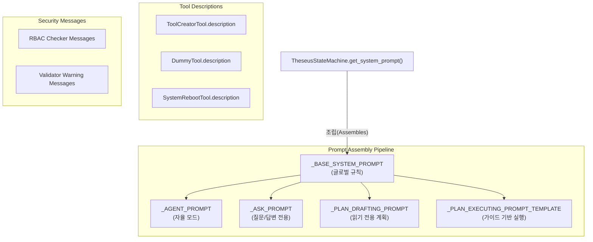

# 테세우스 프롬프트 아키텍처 맵 (Theseus Prompt Architecture Map)

이 문서는 테세우스 고유의 모든 프롬프트 파일, 그 위치, 역할 및 간단한 설명을 카탈로그화한 것입니다. 이 프롬프트들은 AI 에이전트의 페르소나, 가드레일, 그리고 운영 지능을 종합적으로 정의합니다.

---

## 1. 핵심 시스템 프롬프트 (Core System Prompts)

### `theseus_engine/models/state.py`

**중앙 프롬프트 오케스트레이터**. 모든 시스템 프롬프트 상수를 포함하며, 현재 에이전트 모드에 기반하여 최종 시스템 프롬프트를 동적으로 조립하는 `TheseusStateMachine` 클래스를 포함합니다.

| 프롬프트 상수 | 역할 | 설명 |
|---|---|---|
| `_BASE_SYSTEM_PROMPT` | 글로벌 규칙 | 테세우스의 정체성, 페르소나, 환경 정보, 작업/도구/코드 규칙, RBAC 인지, 검증 파이프라인 인지, 컨텍스트 관리. **모든** 모드에 공통 적용됩니다. |
| `_AGENT_PROMPT` | 에이전트 모드 | 자율 실행 규칙. 자유로운 도구 사용, 모드 전환 안내 (필요시 Plan/Ask 모드 제안). |
| `_ASK_PROMPT` | 질문(Ask) 모드 | 지식 기반 응답 전용 규칙. 도구 사용을 엄격히 금지합니다. |
| `_PLAN_DRAFTING_PROMPT` | 계획(Plan) → 초안 작성 단계 | 읽기 전용(READ-ONLY) 제약. 금지된 작업(파일 생성, 수정, 삭제, 상태 변경 등)의 명시적 목록을 포함합니다. |
| `_PLAN_EXECUTING_PROMPT_TEMPLATE` | 계획(Plan) → 실행 단계 | 사용자 승인된 계획 컨텍스트 하에서의 실행 규칙. `create_tool` 검증 복구를 위한 메타-툴링 피드백 루프 규칙을 포함합니다. |
| `MODE_DESCRIPTIONS` | 표시 레이블 | TUI 사이드바에 표시되는 사람이 읽을 수 있는 모드 설명. |

---

## 2. 검증기 프롬프트 (Validator Prompts)

### `theseus_engine/validators/suggestion_validator.py`

| 프롬프트 상수 | 역할 | 설명 |
|---|---|---|
| `_REVIEW_SYSTEM_PROMPT` | 코드 리뷰 | LLM 기반 코드 품질 검토기를 위한 시스템 프롬프트. 파이썬 관용구(Pythonic idioms), 성능, 에러 처리, 그리고 타입 힌트에 대해 코드를 리뷰하도록 모델에 지시합니다. (현재는 스텁(Stub) 상태 — TheseusLLMClient 연동 대기 중.) |

---

## 3. 도구 설명 (Tool Descriptions, LLM-facing)

이것들은 도구 호출 API 스키마의 일부로서 LLM에 직접 전달되는 도구 클래스의 `description` 속성입니다.

### `theseus_engine/tools/tool_factory.py`

| 도구 | 설명 역할 |
|---|---|
| `ToolCreatorTool.description` | 새로운 도구를 언제, 어떻게 생성할지 LLM에 지시합니다. 중요 제약 사항 포함: Plan 모드의 실행(Executing) 단계에서만 사용 가능, 도구를 생성한 턴과 같은 턴에서 해당 도구를 호출할 수 없음. |

### `theseus_engine/tools/tools.py`

| 도구 | 설명 역할 |
|---|---|
| `DummyTool.description` | 안전한 읽기 전용 에코 도구. 파급 범위(Blast radius)가 '없음(NONE)'임을 설명합니다. |
| `SystemRebootTool.description` | 고위험 관리자 도구. 명시적인 사용자 승인이 필요한 '심각(CRITICAL)' 수준의 파급 범위를 설명합니다. |

---

## 4. RBAC 권한 메시지 (RBAC Permission Messages)

### `theseus_engine/models/rbac.py`

| 메시지 | 역할 | 설명 |
|---|---|---|
| `[RBAC Denied]` | 접근 거부 | 도구를 실행하기 위한 사용자의 권한 레벨이 부족할 때 반환됩니다. 사용자 레벨과 요구 레벨을 포함합니다. |
| `[Security Policy]` | 승인 필요 | 항상 명시적인 사용자 승인이 필요한 민감한 도구(bash, write_file, edit_file) 호출 시 반환됩니다. |
| `[RBAC Approved]` | 자동 승인 | 상태 변경(mutating) 도구에 대한 부모 검사기의 승인 요구를 RBAC가 재정의(Override)할 때 반환됩니다. |

---

## 5. 관측성 프롬프트 (Observability Prompts)

### `theseus_engine/observability/tracer.py`

LLM 프롬프트는 없지만, LangSmith 관측성 기능의 활성화 여부를 결정하는 **트레이싱 설정 로직**을 포함합니다. 미설정 시의 바이패스 메커니즘(no-op)이 이곳에 문서화되어 있습니다.

---

## 아키텍처 다이어그램 (Architecture Diagram)

