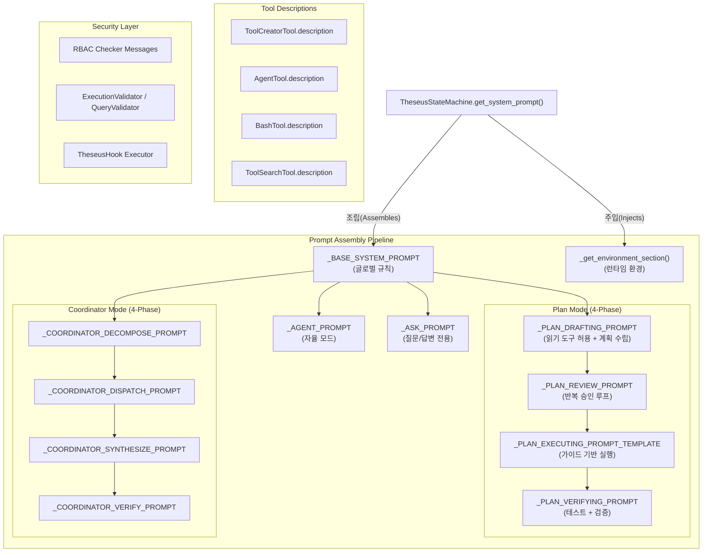

# 테세우스 프롬프트 아키텍처 맵 (Theseus Prompt Architecture Map)

이 문서는 테세우스 고유의 모든 프롬프트 파일, 그 위치, 역할 및 간단한 설명을 카탈로그화한 것입니다. 이 프롬프트들은 AI 에이전트의 페르소나, 가드레일, 그리고 운영 지능을 종합적으로 정의합니다.

> **최종 업데이트**: 2026-05-13 — Extension user-message template 영어화

---

## 1. 핵심 시스템 프롬프트 (Core System Prompts)

### `theseus_engine/models/state.py`

**중앙 프롬프트 오케스트레이터**. 모든 시스템 프롬프트 상수를 포함하며, 현재 에이전트 모드에 기반하여 최종 시스템 프롬프트를 동적으로 조립하는 `TheseusStateMachine` 클래스를 포함합니다.

#### 1.1 글로벌 프롬프트

| 프롬프트 상수 | 역할 | 설명 |
|---|---|---|
| `_BASE_SYSTEM_PROMPT` | 글로벌 규칙 | 테세우스의 정체성, 작업/코드 규칙, 보안 기본값, 에러 루프 방지, 컨텍스트 관리. **모든** 모드에 공통 적용됩니다. Tool/RBAC/검증/web/create_tool 세부 지침은 capability 섹션에서 조건부 주입합니다. |
| `_get_environment_section()` | 런타임 환경 | OS, 아키텍처, 셸, CWD, Python 버전, Git 브랜치 등을 동적으로 감지하여 프롬프트에 주입합니다. |
| `PromptCapabilities` | 조건부 capability | 현재 tool schema, mode/phase, runtime reminder를 바탕으로 어떤 capability 프롬프트를 붙일지 결정합니다. |
| `MODE_DESCRIPTIONS` | 표시 레이블 | TUI 사이드바에 표시되는 사람이 읽을 수 있는 모드 설명. |

#### 1.1.1 Capability 프롬프트

| 프롬프트 상수 | 주입 조건 | 역할 |
|---|---|---|
| `_TOOL_USE_CAPABILITY_PROMPT` | 현재 schema에 하나 이상의 tool이 있을 때 | 존재하는 tool만 호출하고 전용 tool을 우선하도록 안내 |
| `_RBAC_CAPABILITY_PROMPT` | tool capability가 있을 때 | 권한 필터링 사실과 권한 밖 요청 대응 지침 |
| `_VALIDATION_CAPABILITY_PROMPT` | tool capability가 있을 때 | validator block 결과를 읽고 수정 후 재시도하는 지침 |
| `_WEB_RESEARCH_CAPABILITY_PROMPT` | `web_search`, `web_fetch`, `deep_research` 중 하나가 있을 때 | 외부 명세 확인이 필요한 작업의 web research 기준 |
| `_CREATE_TOOL_CAPABILITY_PROMPT` | `create_tool`이 현재 schema에 있을 때 | Theseus custom tool 생성 코드 규약과 2턴 호출 규칙 |

#### 1.2 모드별 프롬프트

| 프롬프트 상수 | 모드 | 역할 | 주요 규칙 |
|---|---|---|---|
| `_ASK_PROMPT` | Ask | 질문/답변 전용 | 도구 사용 엄격 금지. 지식 기반 응답만 제공. |
| `_AGENT_PROMPT` | Agent | 자율 실행 | 도구 자유 사용. 모드 전환 가이드(Plan/Ask 제안) 포함. `create_tool` 금지. |

#### 1.3 Plan 모드 프롬프트 (4단계 파이프라인)

| 프롬프트 상수 | 단계 | 역할 | 주요 규칙 |
|---|---|---|---|
| `_PLAN_DRAFTING_PROMPT` | Drafting | 코드베이스 조사 + 제안서 작성 | **읽기 도구 허용** (`read_file`, `glob`, `grep`, 읽기 전용 bash). Research→Analyze→Plan 3단계 워크플로우. **Tier 분류** (T1 Quick Win / T2 Strategic / T3 Architecture). 확장된 JSON 스키마: `context{problem_analysis, affected_files, risks}`, `tasks[]{tier, problem, solution, target_files, integration_points, expected_effect}`, `verification{test_commands, manual_checks, success_criteria}`, `action_plan{immediate, sequential_dependencies, estimated_turns}`. |
| `_PLAN_REVIEW_PROMPT` | WaitForReview | 반복 승인 루프 | 사용자의 approve/edit/질문/cancel 처리. 수정 시 변경점 표시 + 업데이트된 계획 재제시. 승인까지 반복. 조사 위해 읽기 도구 사용 가능. |
| `_PLAN_EXECUTING_PROMPT_TEMPLATE` | Executing | 승인된 계획 실행 | Tier/action_plan 기반 실행 순서 결정. 즉시 도구 호출 강제. `create_tool` 2턴 규칙. 진행 상황 보고(`[Progress] task-N complete (N/total)`). 예상외 복잡도 발견 시 중단 의무. |
| `_PLAN_VERIFYING_PROMPT` | Verifying | 실행 결과 검증 | 테스트 실행, 변경 파일 리뷰, 회귀 확인, 계획 완료율 확인. 구조화된 검증 결과 출력 (Tests/Changes/Issues/Plan completion). 사소한 수정만 허용, 근본적 문제 시 Drafting 회귀 권고. |

PLAN 실행/검증 완료는 하위 호환을 위해 기존 문자열 marker도 유지합니다. local runner는 해당 marker를 감지하면 `PlanPhaseTransitionRequested` 구조화 이벤트를 함께 발행해 editor/daemon 클라이언트가 assistant prose를 직접 파싱하지 않도록 합니다.

#### 1.4 Coordinator 모드 프롬프트 (4단계 오케스트레이션)

| 프롬프트 상수 | 단계 | 역할 | 주요 규칙 |
|---|---|---|---|
| `_COORDINATOR_DECOMPOSE_PROMPT` | Decompose | 작업 분해 | 병렬 실행 가능한 독립적 서브태스크로 분해. 2-6개 서브태스크 권장. JSON 리스트 출력. |
| `_COORDINATOR_DISPATCH_PROMPT` | Dispatch | 워커 모니터링 | `task_output`으로 워커 결과 확인. 실패 시 진단/재시도. 합성 전 완료 대기. |
| `_COORDINATOR_SYNTHESIZE_PROMPT` | Synthesize | 결과 통합 | 워커 출력 통합. 충돌 해결, 코드 병합, 일관성 확보. 초과 기능 추가 금지. |
| `_COORDINATOR_VERIFY_PROMPT` | Verify | 최종 검증 | 테스트/검증 수행. 원래 요구사항 대비 결과 비교. 정직한 보고. |

---

## 2. 프롬프트 조립 파이프라인

`TheseusStateMachine.get_system_prompt()` 메서드가 현재 모드/단계에 따라 프롬프트를 동적으로 조합합니다:

```
최종 프롬프트 =
  _BASE_SYSTEM_PROMPT
  + _get_environment_section()
  + 모드별 프롬프트
  + 현재 tool schema 기반 capability 프롬프트
  + runtime reminder
```

### 2.1 VSCode Extension user-message template 주입

VSCode Extension은 별도 system prompt를 소유하지 않습니다. 시스템 프롬프트는 `state.py`의 `TheseusStateMachine.get_system_prompt()`가 canonical source of truth입니다. Extension이 LLM 입력에 추가하는 문자열은 모두 user message template 또는 보조 컨텍스트이며, 기본 문구는 영어로 유지합니다.

| 위치 | 주입 경로 | 역할 | 언어 원칙 |
|---|---|---|---|
| `vscode-extension/src/workspace/WorkspaceContext.ts::injectCursorContext()` | `send` / `sendWithMode` 직전 | 사용자가 현재 편집기 컨텍스트를 명시할 때만 active editor file을 `IDE auxiliary context`로 첨부 | English |
| `vscode-extension/src/extension.ts::diagnosticPrompt()` | `Theseus: Explain Problem`, `Theseus: Fix Problem` | VSCode Problems diagnostic의 file/line/message/code/source와 explain/fix 요청을 입력창에 삽입 | English |
| `vscode-extension/src/extension.ts::theseus.explainSelected` | 선택 코드 설명 command | 선택한 코드 블록과 `Explain this code.` 요청을 입력창에 삽입 | English |

이 template들은 `state.py`의 communication-language rule보다 낮은 우선순위의 user message입니다. 사용자가 추가로 한국어 지시를 붙이면 `state.py`의 언어 정책에 따라 답변 언어가 조정될 수 있습니다.

### 상태 전환 흐름

```
[Agent] ←→ [Ask]
  ↕
[Plan]
  └→ Drafting (읽기 도구로 코드베이스 조사 → 제안서 스타일 JSON 출력)
  └→ WaitForReview (반복 승인 루프: approve/edit/feedback/cancel)
  └→ Executing (Tier 순서로 계획 단계별 실행 + Progress 보고)
  └→ Verifying (테스트 실행 + 변경 검증 + 구조화된 결과 보고)
  ↕
[Coordinator]
  └→ Decompose → Dispatch → Synthesize → Verify
```

### Plan JSON 스키마 레퍼런스

DRAFTING 단계에서 LLM이 출력하는 JSON의 구조입니다. `_display_plan()`과 `_extract_plan_json()`이 이 스키마를 파싱합니다.

```
{
  goal:     string            -- 한 문장 목표 요약
  context: {                  -- 코드베이스 조사 결과
    current_state:   string
    problem_analysis: string
    affected_files:  [string]
    risks:           string
  }
  tasks: [{                   -- 계층적 태스크 목록
    id:                string       -- 고유 ID (e.g. "task-1", "task-1-1")
    parent_id:         string|null  -- null = 메인 태스크
    tier:              "T1"|"T2"|"T3"  -- Impact/Effort 분류 (메인만)
    title:             string
    problem:           string       -- 해결할 문제 (메인만)
    solution:          string       -- 해결 방안 (메인만)
    target_files:      [string]     -- 수정 대상 파일 경로
    integration_points: string      -- 기존 코드 연동 지점 (선택)
    expected_effect:   string       -- 예상 효과 (메인만)
    description:       string       -- 상세 설명
    status:            "pending"|"running"|"done"|"failed"
  }]
  verification: {             -- 검증 계획
    test_commands:    [string]
    manual_checks:    [string]
    success_criteria: string
  }
  action_plan: {              -- 실행 순서 계획
    immediate:               [string]  -- 즉시 착수할 태스크 ID
    sequential_dependencies: string    -- 순서 의존성 (선택)
    estimated_turns:         string    -- 예상 소요 턴 수
  }
}
```

---

## 3. 검증기 프롬프트 (Validator Prompts)

### `theseus_engine/validators/suggestion_validator.py`

| 프롬프트 상수 | 역할 | 설명 |
|---|---|---|
| `_REVIEW_SYSTEM_PROMPT` | 코드 리뷰 | LLM 기반 코드 품질 검토기를 위한 시스템 프롬프트. 파이썬 관용구(Pythonic idioms), 성능, 에러 처리, 그리고 타입 힌트에 대해 코드를 리뷰하도록 모델에 지시합니다. (현재는 스텁(Stub) 상태 — TheseusLLMClient 연동 대기 중.) |

---

## 4. 서버 Worker 프롬프트 주입 (Server Worker Prompt Injection)

FastAPI `src` 계층은 Kafka/SSE 통신, 인증, checkpoint, publish를 담당합니다. LLM 호출이 필요한 서버 worker도 별도 시스템 프롬프트를 소유하지 않고 `src/builder/system_prompt.py`를 통해 `theseus_engine.models.state.TheseusStateMachine.get_system_prompt()`를 mode/phase별로 주입합니다.

### `src/builder/system_prompt.py`

| 함수 | 역할 | 설명 |
|---|---|---|
| `build_theseus_system_prompt()` | 서버 요청용 시스템 프롬프트 조립 | `AgentMode`, `PlanPhase`, `CoordinatorPhase`, 승인 plan payload, 현재 활성 tool 이름을 받아 `state.py`의 canonical 프롬프트를 반환합니다. |

### 적용 경로

| `src` 경로 | 주입 모드/단계 | 요청별 입력 계약 |
|---|---|---|
| `src/routes/stream.py` → `src/builder/engine.py` | `AGENT`, 또는 plan 실행 시 `PLAN/EXECUTING` | 사용자 prompt와 Spring history를 `QueryEngine` 메시지로 전달합니다. |
| `src/tool_plan/planner.py` | 생성은 `PLAN/DRAFTING`, 재생성은 `PLAN/WAIT_FOR_REVIEW` | ToolPlan JSON schema, base plan, feedback, history snapshot은 user message에 포함합니다. |
| `src/tool_build/builder.py` | `PLAN/EXECUTING` | ToolBuild JSON/code schema와 검증 실패 repair context는 user message에 포함합니다. |
| `src/tool_generation/processor.py` | legacy 요청을 `PLAN/DRAFTING` 또는 `PLAN/WAIT_FOR_REVIEW`로 변환 | 기존 `theseus.tool-generation.*` 통신을 임시 유지하기 위한 adapter입니다. |

레거시 ToolGeneration consumer는 최종 ToolPlan markdown을 여러 `chunk` 이벤트로 나누어 기존 UI의 스트리밍형 표시를 유지합니다. API 서버가 새 `tool-plan`/`tool-build` 토픽으로 전환되기 전까지는 `CORE_LEGACY_TOOL_GENERATION_CONSUMER_ENABLED=true`, `CORE_TOOL_PLAN_CONSUMER_ENABLED=false`가 기본 운영 조합입니다. 전환 후에는 `CORE_TOOL_PLAN_CONSUMER_ENABLED=true`로 신규 ToolPlan consumer를 켜고, 필요 시 `CORE_LEGACY_TOOL_GENERATION_CONSUMER_ENABLED=false`로 legacy adapter를 끕니다.

---

## 5. 도구 설명 (Tool Descriptions, LLM-facing)

이것들은 도구 호출 API 스키마의 일부로서 LLM에 직접 전달되는 도구 클래스의 `description` 속성입니다.

### `theseus_engine/tools/tool_factory.py`

| 도구 | 설명 역할 |
|---|---|
| `ToolCreatorTool.description` | 새로운 도구를 언제, 어떻게 생성할지 LLM에 지시합니다. 중요 제약 사항 포함: Plan 모드의 실행(Executing) 단계에서만 사용 가능, 도구를 생성한 턴과 같은 턴에서 해당 도구를 호출할 수 없음. |

### `theseus_engine/tools/core/`

| 도구 파일 | 설명 역할 |
|---|---|
| `agent_tool.py` | 서브 에이전트 디스패치 도구. Coordinator 모드에서 병렬 워커 생성에 사용. |
| `bash_tool.py` | 셸 명령 실행 도구. RBAC 및 ExecutionValidator 검증 대상. |
| `tool_search_tool.py` | 동적 도구 검색 도구. 사용 가능한 도구 목록을 런타임에 조회. |

### `theseus_engine/tools/tools.py`

| 도구 | 설명 역할 |
|---|---|
| `DummyTool.description` | 안전한 읽기 전용 에코 도구. 파급 범위(Blast radius)가 '없음(NONE)'임을 설명합니다. |
| `SystemRebootTool.description` | 고위험 관리자 도구. 명시적인 사용자 승인이 필요한 '심각(CRITICAL)' 수준의 파급 범위를 설명합니다. |

---

## 6. RBAC 권한 메시지 (RBAC Permission Messages)

### `theseus_engine/models/rbac.py`

| 메시지 | 역할 | 설명 |
|---|---|---|
| `[RBAC Denied]` | 접근 거부 | 도구를 실행하기 위한 사용자의 권한 레벨이 부족할 때 반환됩니다. 사용자 레벨과 요구 레벨을 포함합니다. |
| `[Security Policy]` | 승인 필요 | 항상 명시적인 사용자 승인이 필요한 민감한 도구(bash, write_file, edit_file) 호출 시 반환됩니다. |
| `[RBAC Approved]` | 자동 승인 | 상태 변경(mutating) 도구에 대한 부모 검사기의 승인 요구를 RBAC가 재정의(Override)할 때 반환됩니다. |

---

## 7. 관측성 프롬프트 (Observability Prompts)

### `theseus_engine/observability/tracer.py`

LLM 프롬프트는 없지만, LangSmith 관측성 기능의 활성화 여부를 결정하는 **트레이싱 설정 로직**을 포함합니다. 미설정 시의 바이패스 메커니즘(no-op)이 이곳에 문서화되어 있습니다.

---

## 8. 컨텍스트 관리 (Context Management)

### `theseus_engine/core/context_compressor.py`

| 기능 | 설명 |
|---|---|
| `ContextCompressor` | 대화 히스토리가 컨텍스트 윈도우 한계에 도달했을 때 자동으로 이전 메시지를 압축합니다. 시스템 프롬프트의 "The system will automatically compress prior messages" 규칙과 연동됩니다. |

---

## 아키텍처 다이어그램 (Architecture Diagram)



---

## 변경 이력

| 날짜 | 변경 내용 |
|---|---|
| 2025-05-07 | Plan JSON 스키마 대폭 확장 (tier, problem, solution, target_files, expected_effect, context, verification, action_plan). 제안서 스타일 `_display_plan` 리디자인. Plan 모드 VERIFYING 단계 추가. DRAFTING에 Research→Analyze→Plan 워크플로우 및 읽기 도구 허용. REVIEW 반복 승인 루프 적용. EXECUTING에 Tier 기반 실행 순서. Coordinator 모드 프롬프트 문서화. 도구 설명에 core 도구 추가. 컨텍스트 관리 섹션 추가. |
| 2025-04-xx | 초기 버전. 4-Mode 아키텍처 문서화. |
