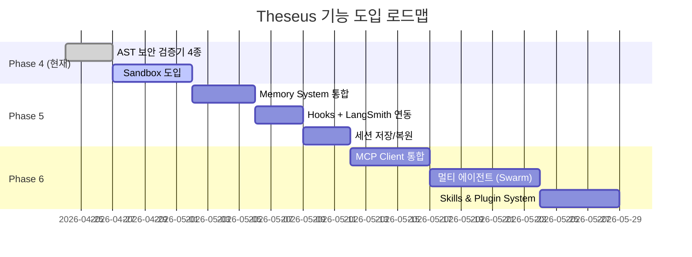

# Theseus × OpenHarness 미사용 핵심 기능 분석 및 도입 제안

> **작성일**: 2026-04-24  
> **작성자**: Developer B (AI Engine 담당)  
> **대상**: Theseus AI Engine 고도화 로드맵

---

## 1. 분석 개요

OpenHarness 엔진 내부에는 약 **30개 이상의 서브모듈**이 존재하지만, 현재 Theseus가 활용하고 있는 것은 핵심 엔진(`engine/`), API 클라이언트(`api/`), 도구 시스템(`tools/`), 권한(`permissions/`), 설정(`config/`) 정도입니다.

본 문서는 **OpenHarness에 이미 존재하지만 Theseus에서 아직 사용하지 않는 주요 기능**들과, **상용 에이전트 시스템(Cursor, Copilot, ChatGPT, Claude, Devin 등)에서 핵심으로 사용되지만 현재 Theseus에 부재한 기능**들을 분석하고 도입 우선순위를 제안합니다.

---

## 2. OpenHarness 미사용 핵심 모듈

### 2.1 🧠 Memory System (`memory/`)

| 항목 | 설명 |
|---|---|
| **모듈 경로** | `openharness/memory/` |
| **핵심 기능** | 프로젝트별 마크다운 기반 메모리 파일 관리 (CRUD) |
| **주요 API** | `add_memory_entry()`, `remove_memory_entry()`, `list_memory_files()` |
| **Theseus 활용도** | ❌ 미사용 |

**도입 이유**: 상용 서비스(Cursor, Claude)는 세션 간 컨텍스트를 유지하기 위해 프로젝트 메모리를 적극 활용합니다. 현재 Theseus는 대화가 끊기면 이전 작업의 맥락을 완전히 잃어버립니다.

**제안**:
- `MEMORY.md` 인덱스 파일을 프로젝트 루트에 생성하여 에이전트가 참조
- 툴 생성 이력, 사용자 선호도, 프로젝트 아키텍처 메모 등을 자동 저장
- Agent 모드 시스템 프롬프트에 메모리 컨텍스트 자동 주입

**우선순위**: 🔴 높음

---

### 2.2 🔒 Sandbox System (`sandbox/`)

| 항목 | 설명 |
|---|---|
| **모듈 경로** | `openharness/sandbox/` |
| **핵심 기능** | Docker/srt 기반 코드 격리 실행, 파일시스템/네트워크 접근 제한 |
| **주요 API** | `wrap_command_for_sandbox()`, `get_sandbox_availability()` |
| **Theseus 활용도** | ❌ 미사용 |

**도입 이유**: B2B 플랫폼에서 사용자가 `create_tool`로 임의의 파이썬 코드를 생성하고 실행합니다. 현재는 호스트 환경에서 직접 실행되므로, 악의적이거나 버그가 있는 코드가 시스템을 손상시킬 수 있습니다.

**제안**:
- Docker 기반 샌드박스를 기본 실행 환경으로 설정
- `ToolCreatorTool`이 생성한 코드를 샌드박스 내에서 검증 실행 후 승인
- 네트워크 접근 화이트리스트(예: API 호출에 필요한 도메인만 허용)

**우선순위**: 🔴 높음 (보안 필수)

---

### 2.3 🐝 Swarm / Multi-Agent System (`swarm/`, `coordinator/`)

| 항목 | 설명 |
|---|---|
| **모듈 경로** | `openharness/swarm/`, `openharness/coordinator/` |
| **핵심 기능** | 멀티 에이전트 협업, Teammate 생성/메시지/권한 동기화, Team Registry |
| **주요 API** | `TeammateExecutor`, `TeammateMailbox`, `AgentDefinition`, `TeamRegistry` |
| **Theseus 활용도** | ❌ 미사용 |

**도입 이유**: Devin, Claude Orchestrator, CrewAI 같은 최신 시스템은 단일 에이전트가 아닌 **팀 기반 에이전트 오케스트레이션**을 지원합니다. 복잡한 프로젝트에서 Planner, Coder, Reviewer, Tester 등 역할별 에이전트가 협업합니다.

**제안**:
- Phase 5로 멀티 에이전트 파이프라인 도입 고려
- `coordinator/agent_definitions.py`의 Built-in Agent 정의를 참고하여 Theseus 전용 에이전트 역할 설계
- 우선은 단일 에이전트 내 역할 전환(현재 3-Mode 시스템)을 고도화한 후, 실제 병렬 에이전트로 확장

**우선순위**: 🟡 중간 (Phase 5 이후)

---

### 2.4 🔌 MCP (Model Context Protocol) Client (`mcp/`)

| 항목 | 설명 |
|---|---|
| **모듈 경로** | `openharness/mcp/` |
| **핵심 기능** | 외부 MCP 서버와의 연결, 외부 도구 및 리소스 동적 로드 |
| **주요 API** | `McpClientManager`, `McpToolInfo`, `McpResourceInfo` |
| **Theseus 활용도** | ❌ 미사용 |

**도입 이유**: MCP는 AI 에이전트의 새로운 표준 프로토콜로, 외부 데이터 소스와 도구를 표준화된 방식으로 연결합니다. Cursor, Claude Desktop 등 주요 서비스가 이미 MCP를 지원합니다.

**제안**:
- 기업 고객이 자체 MCP 서버(DB 조회, 내부 API 등)를 연결할 수 있도록 MCP 클라이언트 통합
- `McpClientManager`를 통해 외부 도구를 동적으로 `ToolRegistry`에 등록
- B2B 플랫폼의 확장성을 극대화하는 핵심 차별화 요소

**우선순위**: 🟡 중간

---

### 2.5 🎣 Hooks System (`hooks/`)

| 항목 | 설명 |
|---|---|
| **모듈 경로** | `openharness/hooks/` |
| **핵심 기능** | 이벤트 기반 훅 실행 (tool_before, tool_after, message_before 등) |
| **주요 API** | `HookExecutor`, `HookRegistry`, `HookEvent` |
| **Theseus 활용도** | ❌ 미사용 (query.py에 hook_executor 파라미터는 존재하지만 None으로 전달) |

**도입 이유**: LangSmith 로깅, 감사 로그, 비용 추적, 슬랙 알림 등을 훅으로 구현하면 코어 로직을 수정하지 않고도 관측성(Observability)을 확보할 수 있습니다.

**제안**:
- 최소한 `tool_after` 훅을 구현하여 모든 툴 실행 결과를 감사 로그에 기록
- LangSmith 연동 훅 구현 (비용 추적, 성능 모니터링)
- 기업 고객별 커스텀 훅 등록 API 제공

**우선순위**: 🟡 중간

---

### 2.6 🔧 Skills System (`skills/`)

| 항목 | 설명 |
|---|---|
| **모듈 경로** | `openharness/skills/` |
| **핵심 기능** | 재사용 가능한 프롬프트+도구 번들, Skills Loader 및 Registry |
| **주요 API** | `SkillRegistry`, `load_bundled_skills()` |
| **Theseus 활용도** | ❌ 미사용 |

**도입 이유**: 현재 Theseus의 `create_tool`은 개별 도구만 생성하지만, 실제 업무에서는 여러 도구 + 가이드 프롬프트를 하나의 "스킬"로 묶어 관리하는 것이 효과적입니다.

**제안**:
- 툴 + 프롬프트 + 설정을 하나의 스킬 패키지로 묶는 `SkillBundle` 개념 도입
- 기업 고객이 자체 스킬을 공유/마켓플레이스에 등록하는 B2B 기능

**우선순위**: 🟢 낮음 (Phase 6 이후)

---

### 2.7 📦 Plugin System (`plugins/`)

| 항목 | 설명 |
|---|---|
| **모듈 경로** | `openharness/plugins/` |
| **핵심 기능** | 외부 플러그인 로드, 설치, 타입 검증 |
| **주요 API** | `PluginLoader`, `PluginInstaller` |
| **Theseus 활용도** | ❌ 미사용 |

**제안**: Skills와 유사하지만 더 범용적인 확장 메커니즘. Phase 6 이후 고려.

**우선순위**: 🟢 낮음

---

### 2.8 ⏰ Services: Session & Cron (`services/`)

| 항목 | 설명 |
|---|---|
| **모듈 경로** | `openharness/services/` |
| **핵심 기능** | 세션 저장/복원, 크론 기반 반복 작업 스케줄링, 토큰 추정 |
| **주요 API** | `SessionStorage`, `CronScheduler`, `token_estimation` |
| **Theseus 활용도** | ❌ 미사용 |

**도입 이유**: 
- **세션 저장**: 사용자가 브라우저를 닫았다 다시 열어도 이전 대화를 복원
- **크론 스케줄링**: 정기적인 자동화 작업 (일일 리포트 생성, 주기적 데이터 동기화)
- **토큰 추정**: 비용 관리 및 컨텍스트 윈도우 초과 방지

**우선순위**: 🟡 중간

---

## 3. 상용 서비스 대비 부재 기능

아래는 OpenHarness에 직접 모듈이 없더라도, **상용 에이전트 시스템에서 핵심으로 제공되는 기능** 중 Theseus에 없는 것들입니다.

| 기능 | 참고 서비스 | 현재 상태 | 제안 |
|---|---|---|---|
| **Streaming Cost Tracker** | ChatGPT, Claude | ❌ 미구현 | 토큰 사용량/비용을 실시간 표시하고, 기업 고객별 한도 설정 |
| **Context Window 관리** | Cursor, Claude | ❌ 미구현 | 대화가 길어질 때 자동 요약/압축 (Compact Service) |
| **File Context Injection** | Cursor, Copilot | ❌ 미구현 | 코드 파일을 자동으로 읽어 컨텍스트에 주입 (`@file` 멘션) |
| **Web Search 통합** | ChatGPT, Perplexity | ❌ 미구현 | 실시간 웹 검색 결과를 에이전트 컨텍스트에 제공 |
| **Image/Multimodal 입력** | ChatGPT, Claude | ❌ 미구현 | 스크린샷 기반 UI 분석, 에러 화면 인식 |
| **Undo/Rollback** | Cursor, Windsurf | ❌ 미구현 | 에이전트 작업의 원자적 되돌리기 (Git 연동) |
| **Approval Workflow (비동기)** | Devin, Factory | ❌ 미구현 | 위험한 작업 시 관리자 승인을 비동기로 대기 (Slack/Email 알림) |

---

## 4. 도입 우선순위 로드맵 (제안)

| 단계 | 기능 | 근거 |
|---|---|---|
| **Phase 4** (즉시) | Sandbox, AST 보안 검증기 | `create_tool` 코드 실행의 보안 취약점 해소 필수 |
| **Phase 5** (단기) | Memory, Hooks, Session | 상용 서비스 수준의 사용자 경험 확보 |
| **Phase 6** (중기) | MCP, Swarm, Skills/Plugin | B2B 차별화 및 엔터프라이즈 확장성 |

---

## 5. 결론

현재 Theseus는 OpenHarness의 **핵심 엔진(query loop), 도구 시스템, 권한 시스템**만 활용하고 있으며, 엔진이 제공하는 **메모리, 샌드박스, 멀티 에이전트, MCP, 훅, 스킬** 등의 고급 기능은 전혀 사용하지 않고 있습니다.

특히 **Sandbox**와 **Memory**는 B2B 플랫폼의 보안과 사용성에 직결되므로 즉시 도입을 권장하며, 나머지 기능들은 위 로드맵에 따라 순차적으로 도입하는 것을 제안합니다.
