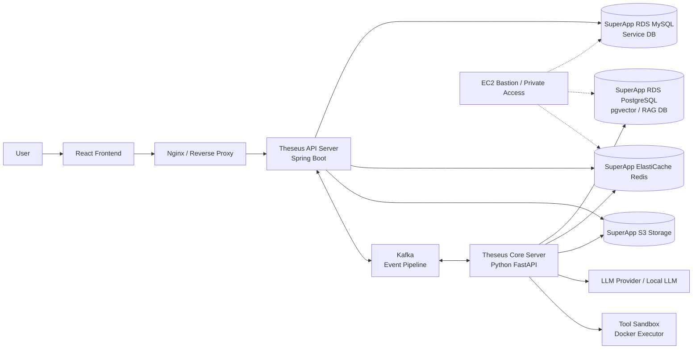
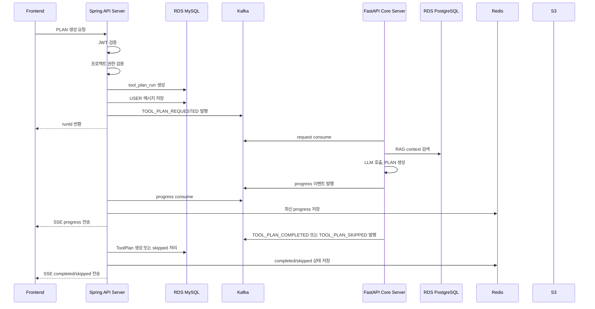
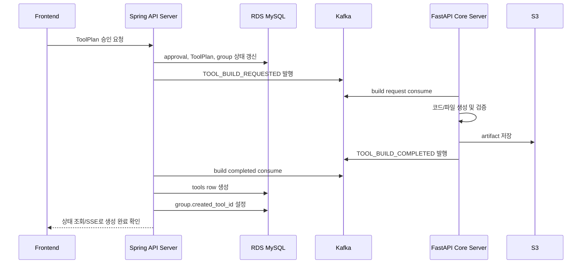

# 테세우스 시스템 아키텍처

## 1. 문서 목적

이 문서는 테세우스 프로젝트의 현재 시스템 아키텍처 기준을 정의한다.

테세우스는 모든 인프라 컴포넌트를 애플리케이션 EC2 내부 Docker 컨테이너로 실행하는 구조가 아니다. 상태 저장이 필요한 데이터베이스, 캐시, 오브젝트 스토리지는 SSAFY SuperApp에서 제공하는 관리형 인프라를 사용한다.

따라서 서버/운영 환경의 아키텍처는 애플리케이션 실행 계층과 데이터 계층을 분리한다.

```text
EC2 = 애플리케이션 실행 계층
SuperApp = 데이터 / 캐시 / 스토리지 계층
```

현재 이 문서는 `docker-compose.server.yml`이나 운영 환경변수 파일을 새로 정의하지 않는다. 이후 docker-compose, 환경변수, CI/CD, 배포 작업을 진행할 때 따라야 할 아키텍처 방향을 먼저 고정하는 문서이다.

## 2. 인프라 경계

### SuperApp 관리형 인프라

| 리소스 | 테세우스 내 역할 |
| --- | --- |
| RDS MySQL | 서비스 메인 데이터베이스 |
| RDS PostgreSQL | AI Core, RAG, pgvector 전용 데이터베이스 |
| ElastiCache Redis | 토큰, 캐시, Tool 생성 진행 상태, SSE 복구 상태 |
| S3 Storage | 업로드 문서, Tool 산출물, 실행 로그, 생성 결과 저장 |

### EC2 애플리케이션 실행 계층

EC2 애플리케이션 실행 계층에는 상태 저장을 최소화한 애플리케이션 컴포넌트를 배포한다.

```text
Nginx / Reverse Proxy
Frontend
Theseus API Server
Theseus Core Server
Kafka
Tool Sandbox / Docker Executor
Jenkins 또는 배포 자동화 구성
```

운영 환경에서는 MySQL, PostgreSQL, Redis를 기본적으로 EC2 내부 컨테이너로 실행하지 않는다. 운영 환경에서는 SuperApp에서 제공받은 endpoint를 환경변수 또는 CI/CD credentials로 주입한다.

## 3. 전체 시스템 아키텍처



## 4. 컴포넌트 책임

### Frontend

Frontend는 React + Vite 기반 사용자 화면이다.

주요 역할:

- 로그인 화면
- 프로젝트 선택 화면
- 채팅형 ToolPlan 생성 화면
- Tool 목록 / 상세 화면
- Tool 승인 / 반려 화면
- 관리자 화면
- SSE 기반 Tool 생성 진행 상태 표시

경계 규칙:

```text
Frontend는 Theseus API Server만 호출한다.
```

Frontend는 Core Server, Redis, Kafka, RDS MySQL, RDS PostgreSQL, S3에 직접 접근하지 않는다.

### Theseus API Server

API Server는 Spring Boot 기반 메인 백엔드이다.

주요 역할:

- 로그인 및 JWT 인증
- 사용자 관리
- 프로젝트 관리
- 프로젝트 멤버 및 권한 관리
- ToolPlan, Tool 메타데이터 관리
- ToolPlan 생성 요청 접수
- ToolPlan 승인 / 반려 플로우
- 채팅 세션 및 메시지 저장
- SSE 연결 관리
- Core Server 실행 전 권한 검증
- 최종 결과 MySQL 저장

연결 대상:

- SuperApp RDS MySQL
- SuperApp ElastiCache Redis
- SuperApp S3
- Kafka

API Server는 제품 데이터와 권한 판단의 기준 서버이다.

### Theseus Core Server

Core Server는 Python FastAPI 기반 AI 실행 서버이다.

주요 역할:

- AI Agent 실행
- ToolPlan 생성 및 재생성
- RAG 검색
- 프롬프트 구성
- 승인된 ToolPlan 기반 코드/파일 생성
- 생성 결과 검증
- 샌드박스 실행
- 실행 로그 생성
- 진행 이벤트 발행

연결 대상:

- SuperApp RDS PostgreSQL
- SuperApp ElastiCache Redis
- SuperApp S3
- Kafka
- LLM Provider 또는 Local LLM
- Docker Sandbox

Core Server는 권한 판단의 기준 서버가 아니다. Core Server는 API Server가 이미 검증한 Kafka payload를 기준으로 AI 작업을 수행한다.

## 5. 데이터 저장 책임

### RDS MySQL

MySQL은 테세우스의 서비스 메인 데이터베이스이다.

저장 대상 예시:

```text
users
projects
project_members
project_roles
chat_sessions
chat_messages
tool_plan_groups
tool_plans
tool_plan_runs
tool_approvals
tools
billing_usage
audit_logs
```

MySQL에는 서비스 운영에 필요한 기준 데이터, 사용자에게 직접 노출되는 데이터, 권한 판단 데이터, 승인 이력, 최종 Tool 상태, 장애 후 복구 기준 데이터를 저장한다.

원칙:

```text
최종 상태는 MySQL에 저장한다.
Redis와 Kafka는 최종 데이터 저장소로 사용하지 않는다.
```

### RDS PostgreSQL

PostgreSQL은 Core Server가 사용하는 AI, RAG, pgvector 전용 데이터베이스이다.

저장 대상 예시:

```text
documents
document_chunks
embeddings
agent_knowledge
prompt_templates
rag_indexes
core_run_checkpoints
core_run_events
```

DB 역할 구분:

```text
MySQL = 서비스 기준 데이터베이스
PostgreSQL = AI 검색 / 임베딩 / RAG 데이터베이스
```

### Redis

Redis는 임시 상태와 빠른 조회가 필요한 데이터에 사용한다.

사용 대상 예시:

```text
Refresh Token 저장
Access Token 블랙리스트
SSE 재연결 복구 상태
ToolPlan 생성 진행 상태
runId 기준 최신 progress 상태
재접속 시 마지막 이벤트 복구 상태
짧은 TTL 캐시
중복 요청 방지 lock
```

Redis key 예시:

```text
tool:plan:{runId}:state
auth:refresh:{userId}
lock:tool-plan:{runId}
```

원칙:

```text
Redis는 최종 저장소가 아니다.
Redis는 캐시, TTL 상태, 진행 상태, 재연결 복구용으로 사용한다.
```

### S3

S3는 파일성 데이터와 생성 산출물을 저장한다.

저장 대상 예시:

```text
사용자 업로드 문서
RAG 원본 문서
Tool 생성 결과 artifact
생성된 코드 zip 파일
실행 로그 파일
샌드박스 실행 결과물
이미지 및 첨부파일
대용량 분석 결과
```

S3 key 예시:

```text
tools/{toolId}/versions/{versionId}/artifact.zip
tools/{toolId}/runs/{runId}/execution-log.json
projects/{projectId}/documents/{documentId}/original.pdf
projects/{projectId}/documents/{documentId}/chunks.json
```

DB에는 대용량 파일 본문을 저장하지 않고 S3 key만 저장한다.

## 6. Kafka 책임

Kafka는 API Server와 Core Server 사이의 비동기 이벤트 파이프라인이다.

Kafka 사용 대상:

- ToolPlan 생성 요청
- ToolPlan 재생성 요청
- Tool build 요청
- Tool 실행 요청
- 진행 상태 이벤트
- 완료 이벤트
- 실패 이벤트
- 실행 로그 이벤트

추천 Topic 구조:

```text
theseus.tool-plan.request
theseus.tool-plan.event
theseus.tool-build.request
theseus.tool-build.event

tool-execution.request
tool-execution.progress
tool-execution.completed
tool-execution.failed
```

내부 흐름:

```text
API Server -> Kafka -> Core Server
Core Server -> Kafka -> API Server
API Server -> SSE -> Frontend
```

Frontend는 Kafka에 직접 접근하지 않는다.

## 7. ToolPlan / Tool 생성 흐름



승인 전에는 `tools` row를 생성하지 않는다. 실제 Tool은 승인된 ToolPlan을 기반으로 Core Server가 code/file artifact 생성을 완료한 뒤 `TOOL_BUILD_COMPLETED` 이벤트를 통해 생성된다.



## 8. Bastion 및 Private Access

운영 환경의 애플리케이션 서버는 DB와 Cache를 직접 컨테이너로 운영하지 않는다. SuperApp RDS와 ElastiCache는 Bastion 서버 또는 허용된 private network 경로를 통해 접근한다.

개념 구조:

```text
Application EC2
   |
   | private access / ssh tunnel / allowed security group
   v
EC2 Bastion
   |
   | private subnet access
   v
SuperApp RDS / ElastiCache
```

이를 통해 애플리케이션 실행 계층과 데이터 계층을 분리하고, EC2 인스턴스의 운영 부담을 줄인다.

## 9. Docker Compose 정책

### Local 환경

로컬 개발 환경에서는 편의를 위해 인프라 컨테이너를 실행할 수 있다.

현재 local compose에는 다음 컴포넌트가 포함될 수 있다.

```text
local MySQL
local PostgreSQL
local Redis
local Kafka
```

이는 로컬 개발용이다.

### Server 또는 Production 환경

서버/운영 compose에는 MySQL, PostgreSQL, Redis 컨테이너를 기본 포함하지 않는다.

서버 compose는 주로 다음 컴포넌트 실행에 집중한다.

```text
frontend
nginx
theseus-api-server
theseus-core-server
kafka
sandbox executor
```

데이터베이스, 캐시, 오브젝트 스토리지 endpoint는 환경변수, Jenkins credentials, 서버 secret 등으로 주입한다.

## 10. 환경변수 정책

실제 운영 값은 Git에 커밋하지 않는다.

운영 값은 다음 방식으로 주입한다.

- Jenkins credentials
- 서버 환경변수
- 배포 환경에서 제공하는 secret management

향후 `.env.prod.example` 파일을 만들 수는 있지만, 실제 credential 값은 포함하지 않는다.

## 11. 아키텍처 규칙

1. Frontend는 API Server만 호출한다.
2. Core Server는 Frontend에 직접 노출하지 않는다.
3. 최종 권한 판단은 API Server가 담당한다.
4. Core Server는 AI 실행, RAG, Tool 생성, 검증, Sandbox 실행에 집중한다.
5. MySQL은 서비스 기준 데이터베이스로 사용한다.
6. PostgreSQL은 Core, RAG, pgvector 전용으로 사용한다.
7. Redis는 토큰, 캐시, 진행 상태, TTL 기반 복구 데이터에 사용한다.
8. S3에는 파일 데이터, 생성 산출물, 로그를 저장하고 DB에는 S3 key를 저장한다.
9. Kafka는 API Server와 Core Server 사이의 내부 비동기 이벤트 파이프라인이다.
10. Production/server compose에서는 MySQL, PostgreSQL, Redis 컨테이너를 중복 실행하지 않는다.
11. Local compose에서는 개발 편의를 위해 DB와 Redis 컨테이너를 실행할 수 있다.
12. 실제 운영 환경 값은 Git에 커밋하지 않는다.
