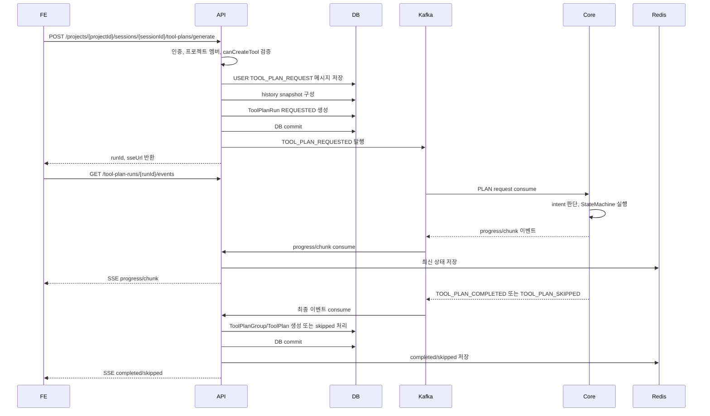
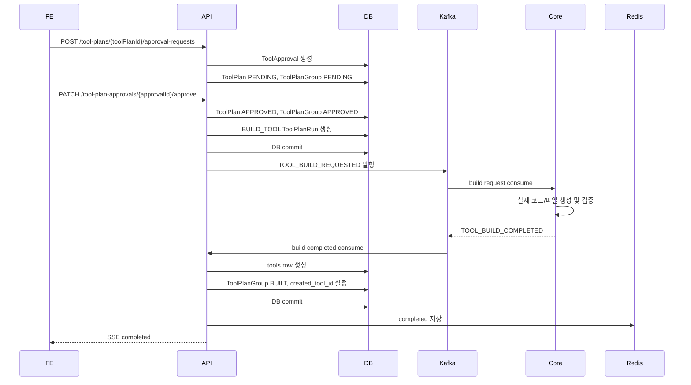

# ToolPlan Execution Flow

## 핵심 원칙

- FE는 API Server와만 HTTP/SSE로 통신한다.
- API Server와 Core Server는 Kafka로 통신한다.
- PLAN 모드 요청은 Tool 생성 요청이 아니라 Tool PLAN 후보 생성 요청이다.
- 승인 전에는 `tools` row를 생성하지 않는다.
- 승인 대상은 `toolPlanId`다.
- 실제 Tool은 승인된 ToolPlan을 기반으로 Core Server가 코드/파일 산출물 생성을 완료한 뒤 생성된다.
- `runId`는 Core 실행 1회를 추적하는 ID다.
- FE SSE 구독과 재연결 복구 기준은 `runId`다.
- Redis는 `tool:plan:{runId}:state`에 최신 상태를 TTL 기반으로 저장한다.
- `chat_messages`에는 최종 사용자 메시지, 최종 Assistant 메시지, 시스템 안내만 저장한다.
- AI가 보내는 progress/chunk는 Redis/SSE 이벤트로만 다룬다.
- `planSnapshot`, history 변환, progress/chunk 세부 규칙은 [ToolPlan Snapshot, History, Progress Rules](./tool-plan-runtime-rules.md)를 따른다.

## 식별자

| 이름 | 생성 주체 | 저장 위치 | 의미 |
| --- | --- | --- | --- |
| `projectId` | DB | DB | 프로젝트 ID |
| `chatSessionId` | DB | DB | 대화 세션 ID |
| `runId` | API Server | DB/Kafka/Redis | Core 실행 1회 ID |
| `toolPlanGroupId` | API Server | DB | 하나의 Tool 후보 흐름 ID |
| `toolPlanId` | API Server | DB | 승인 전 PLAN 버전 ID |
| `toolId` | API Server | DB | build 완료 후 생성된 실제 Tool ID |
| `messageOrder` | API Server | DB | 세션 안의 최종 메시지 순서 |
| `sseStreamKey` | API Server | Memory | `projectId:chatSessionId:runId` |

## 저장소 역할

### API MySQL

| 테이블 | 역할 |
| --- | --- |
| `tool_plan_runs` | 요청/진행/완료/실패/skipped run 상태 |
| `tool_plan_groups` | PLAN 버전 묶음과 최종 Tool 연결 |
| `tool_plans` | 승인 전 Tool 명세 버전 |
| `tools` | 실제 build 완료된 Tool 산출물 |
| `chat_messages` | 최종 사용자 메시지, 최종 Assistant 메시지, 시스템 안내 |
| `tool_approvals` | ToolPlan 승인 요청과 검토 이력 |

### Core PostgreSQL

Core 내부 다회전 에이전트 루프의 checkpoint를 저장한다.

```text
runId
current agent mode
plan phase
current StateMachine state
tool call trace
approved steps
execution results
last processed loop step
last emitted progress sequence
```

API Server의 `planSnapshot`은 Core StateMachine 복원용 checkpoint가 아니다.

### ToolPlan Snapshot

`planSnapshot`은 사용자가 본 PLAN 화면과 승인 대상을 고정하는 API-facing snapshot이다.

```text
tool_plans.plan_snapshot
```

`planSnapshot`은 FE 렌더링, 새로고침 복구, 승인 감사에 사용한다. Core agent loop 재개, tool-use trace, intermediate state 복구에는 사용하지 않는다.

필수 구성:

```text
schemaVersion
planVersion
title
summary
blocks[].blockId
blocks[].title
blocks[].content
blocks[].order
createdAt
```

### Redis

Redis는 ToolPlanRun 최신 상태와 SSE 재연결 복구를 담당한다.

```text
tool:plan:{runId}:state
```

예시:

```json
{
  "runId": "3f2a2d5e-0e4a-4a3f-8d0f-9b5a3e2c0d11",
  "projectId": 1,
  "chatSessionId": 10,
  "eventType": "progress",
  "status": "GENERATING",
  "progressRate": 35,
  "message": "PLAN 구조를 정리하고 있습니다.",
  "updatedAt": "2026-05-08T14:30:00"
}
```

### Kafka

| Topic | 역할 |
| --- | --- |
| `theseus.tool-plan.request` | PLAN 생성/재생성 요청 |
| `theseus.tool-plan.event` | PLAN progress/chunk/completed/skipped/failed |
| `theseus.tool-build.request` | 승인된 PLAN 기반 실제 Tool build 요청 |
| `theseus.tool-build.event` | Tool build completed/failed |

## PLAN 생성 흐름



PLAN 요청 시점에는 `tools` row와 `tool_plans` row를 생성하지 않는다. Core가 유효한 PLAN을 반환하면 그때 `tool_plan_groups`와 `tool_plans`를 생성한다.

## PLAN 재생성 흐름

```text
사용자가 PLAN 카드에 블록별 코멘트 작성
-> FE가 baseToolPlanId, basePlanVersion, feedbackItems 전송
-> API Server가 base ToolPlan 검증
-> API Server가 history snapshot 구성
-> ToolPlanRun 생성
-> Kafka TOOL_PLAN_REGENERATION_REQUESTED 발행
-> Core가 basePlan과 feedbackItems로 최신 전체 PLAN 생성
-> API Server가 같은 planGroupId 아래 새 ToolPlan 생성
```

재생성 요청 시점에도 새 ToolPlan은 즉시 만들지 않는다.

## skipped 흐름

PLAN 모드 입력이 Tool 명세 생성 대상이 아니면 Core는 `TOOL_PLAN_SKIPPED`를 발행한다.

```text
TOOL_PLAN_SKIPPED
-> ToolPlanRun.status = SKIPPED
-> ToolPlanGroup 미생성
-> ToolPlan 미생성
-> Tool 미생성
-> ASSISTANT CHAT 안내 메시지 저장
-> Redis/SSE skipped
```

## 승인 및 build 흐름



관리자 승인만으로는 `tools` row를 생성하지 않는다.

## 저장 순서

요청은 DB에 먼저 기록한 뒤 Kafka로 발행한다.

```text
DB 저장
-> DB commit
-> Kafka 발행
```

Kafka 발행 실패는 Outbox 재시도 또는 run FAILED 처리로 보상한다.

Core completed/skipped/failed 이벤트 처리는 DB commit 후 Redis/SSE를 처리한다.

```text
Kafka event 수신
-> idempotency 확인
-> DB 상태 변경
-> ChatMessage 저장
-> DB commit
-> Redis 저장
-> SSE 전송
```

DB commit 전에 Redis/SSE를 먼저 처리하지 않는다.

## Idempotency

Kafka는 at-least-once 전달이 가능하므로 중복 이벤트를 전제로 처리한다.

중복 방지 기준:

```text
tool_plan_runs.run_id unique
runId + eventType
runId + eventSequence
chat_messages.idempotency_key unique
tool_plans(plan_group_id, plan_version) unique
tools.source_tool_plan_id unique
```

중복 completed 이벤트가 와도 Assistant 메시지, ToolPlan, Tool이 중복 생성되면 안 된다.

## progress/chunk

`progress`는 단계 상태를 알리는 이벤트다. `chunk`는 LLM 스트리밍 텍스트 조각이다.

권장 progress 단계:

```text
REQUEST_RECEIVED
INTENT_CHECKING
HISTORY_LOADING
PLAN_DRAFTING
TOOL_CALLING
TOOL_RESULT_READING
PLAN_STRUCTURING
PLAN_VALIDATING
PLAN_COMPLETED
PLAN_SKIPPED
PLAN_FAILED
```

`progressRate`는 정확한 작업량 비율이 아니라 UI 표시용 추정값이다.

규칙:

```text
eventSequence는 runId 안에서 단조 증가
progressRate는 같은 run 안에서 감소하지 않음
chunk는 임시 표시용이며 최종 메시지로 저장하지 않음
terminal event 이후 progress/chunk는 무시
```

## blockId

블록별 피드백을 위해 Core는 `blockId`를 안정적으로 유지한다.

```text
동일 의미 블록은 재생성 후에도 같은 blockId 유지
새 의미 블록은 새 blockId 생성
삭제된 블록은 다음 PLAN에서 제외
분할/병합 시 대표 의미 기준으로 기존 blockId 유지
```

## 재진입 복구

브라우저 새로고침이나 네트워크 단절이 발생하면 FE는 `runId`로 상태를 복구한다.

```text
1. FE가 ToolPlanRun 상태 조회 API 호출
2. API Server가 Redis tool:plan:{runId}:state 우선 조회
3. Redis 상태가 없으면 DB tool_plan_runs/tool_plans 기준 fallback
4. 진행 중이면 SSE 재연결
```

SSE endpoint:

```http
GET /api/v1/projects/{projectId}/sessions/{sessionId}/tool-plan-runs/{runId}/events
```

상태 조회 endpoint:

```http
GET /api/v1/projects/{projectId}/sessions/{sessionId}/tool-plan-runs/{runId}/state
```

## Failure

### Kafka 발행 실패

```text
Outbox retry
또는 ToolPlanRun FAILED
Redis failed
SSE failed
```

### Core worker 장애

Core worker는 `runId` 기준 checkpoint를 Core DB에 저장한다.

```text
worker 재시작
-> Core DB에서 REQUESTED/GENERATING run checkpoint 조회
-> 재시도 가능한 run 재개 또는 failed 처리
```

MVP에서 중간 loop 재개가 어렵다면 runId 기준 중복 실행 방지와 FAILED 마감부터 구현한다.
