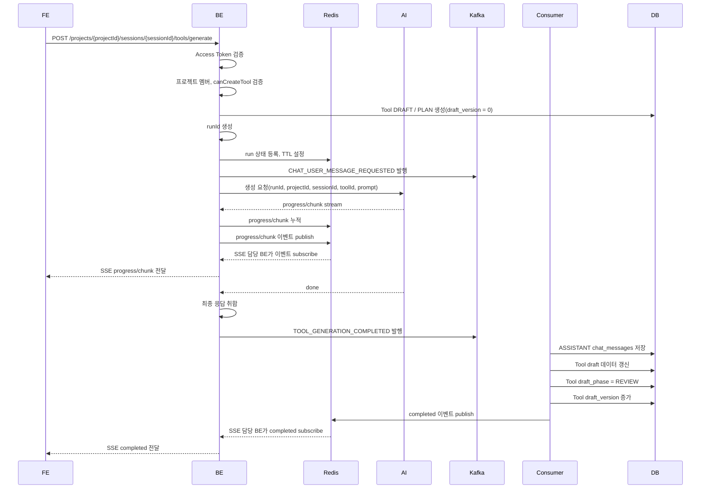

# Tool Execution Flow

## 핵심 원칙

- FE는 BE와만 통신한다.
- FE는 AI 서버, Kafka, Redis에 직접 연결하지 않는다.
- BE는 인증, 프로젝트 접근 권한, Tool 생성 권한을 검증한다.
- AI 생성 1회는 `runId`로 식별한다.
- `runId`는 `chatSessionId`가 아니라 실행 ID다.
- Redis는 진행 중 run 상태, progress/chunk 누적, SSE fanout, 재연결 복구를 담당한다.
- Kafka는 최종 메시지 저장과 Tool 상태 변경을 비동기로 처리한다.
- `chat_messages`에는 최종 사용자 메시지, 최종 Assistant 메시지, 시스템 안내만 저장한다.
- AI가 보내는 progress/chunk는 Redis/SSE 이벤트로만 다룬다.
- FE에 전달되는 `completed` 이벤트는 DB 저장과 Tool 상태 변경 완료를 의미한다.

## 식별자

| 이름 | 생성 주체 | 저장 위치 | 의미 |
| --- | --- | --- | --- |
| `projectId` | DB | DB | 프로젝트 ID |
| `chatSessionId` | DB | DB | 대화 세션 ID |
| `toolId` | BE | DB | 생성 또는 수정 대상 Tool ID |
| `runId` | BE | Redis | AI 생성 실행 1회 ID |
| `messageOrder` | Kafka Consumer | DB | 세션 안의 최종 메시지 순서 |
| `eventSeq` | BE | Redis/SSE | 진행 이벤트 순서 |

한 채팅 세션 안에서 여러 Tool 생성 요청이 발생하면 여러 `runId`가 생긴다.

```text
chatSessionId = 10
runId = 3f2a...  // 첫 번째 Tool 생성
runId = 74bd...  // 같은 Tool 재생성
runId = 91aa...  // 다른 Tool 생성
```

## 저장소 역할

### DB

DB는 최종 상태의 기준 저장소다.

| 테이블 | 역할 |
| --- | --- |
| `tools` | Tool 본체, 상태, Draft 데이터, `draft_version` |
| `chat_sessions` | 대화 세션 |
| `chat_messages` | 최종 사용자 메시지, 최종 Assistant 메시지, 시스템 안내 |
| `tool_approvals` | 승인 요청과 검토 이력 |

진행 중 chunk와 progress 메시지는 DB에 저장하지 않는다.

### Redis

Redis는 실행 중 상태와 실시간 전달을 담당한다.

예시 key:

```text
tool-run:{runId}
tool-run:{runId}:events
```

예시 value:

```json
{
  "runId": "3f2a2d5e-0e4a-4a3f-8d0f-9b5a3e2c0d11",
  "projectId": 1,
  "chatSessionId": 10,
  "toolId": 7,
  "requestedByUserId": 3,
  "requestedByProjectMemberId": 5,
  "status": "RUNNING",
  "lastEventSeq": 18,
  "progressText": "입력 파일 구조를 분석하고 있습니다.",
  "bufferedContent": "...",
  "createdAt": "2026-04-29T14:30:00",
  "expiresAt": "2026-04-29T15:00:00"
}
```

TTL은 예시로 30분을 둔다. 정확한 값은 운영 정책으로 정한다. 이 TTL은 로그인 세션 유지용이 아니라 새로고침, SSE 재연결, 브라우저 일시 이탈 복구용이다.

Redis 이벤트 예시:

```json
{
  "runId": "3f2a2d5e-0e4a-4a3f-8d0f-9b5a3e2c0d11",
  "eventSeq": 19,
  "eventType": "progress",
  "message": "출력 JSON 스키마를 정리하고 있습니다."
}
```

### Kafka

Kafka는 비동기 저장과 상태 변경을 담당한다.

| 이벤트 | 생산자 | 소비자 | 역할 |
| --- | --- | --- | --- |
| `CHAT_USER_MESSAGE_REQUESTED` | BE | Chat Consumer | 사용자 메시지를 `chat_messages`에 저장한다. |
| `TOOL_GENERATION_COMPLETED` | BE | Tool Consumer | 최종 Assistant 메시지 저장, Tool Draft 데이터 갱신, `draft_phase = REVIEW` 변경, `draft_version` 증가를 처리한다. |
| `TOOL_GENERATION_FAILED` | BE | Tool Consumer | 실패 상태 기록, 필요 시 시스템 메시지 저장, Redis 실패 이벤트 발행을 처리한다. |

Kafka Consumer가 `message_order`를 배정한다. 같은 `chat_session_id`에서 다음 순서를 계산하고 저장하는 과정은 트랜잭션으로 처리한다. `(chat_session_id, message_order)` unique constraint는 마지막 방어선이다.

## Draft Tool 생성 흐름



## 단계별 책임

### 1. FE 요청

```http
POST /api/v1/projects/{projectId}/sessions/{sessionId}/tools/generate
Authorization: Bearer {accessToken}
Content-Type: application/json
```

```json
{
  "userMessage": "CSV 파일을 업로드하면 매출 합계를 계산하는 Tool을 만들어줘.",
  "fileName": "sales-summary-tool"
}
```

### 2. BE 요청 수락

1. Access Token 검증
2. 프로젝트 접근 권한 검증
3. Tool 생성 권한 검증
4. `tools.status = DRAFT`, `tools.draft_phase = PLAN`, `tools.draft_version = 0` 생성
5. `runId` 생성
6. Redis에 run 상태 등록
7. Kafka에 USER 메시지 저장 이벤트 발행
8. AI 서버에 생성 요청

USER 메시지는 Kafka Consumer가 `chat_messages`에 저장한다.

### 3. AI 생성 요청

BE는 AI 서버에 `runId`, `projectId`, `chatSessionId`, `toolId`, 사용자 프롬프트, 권한 컨텍스트, 생성 가이드라인을 전달한다.

```json
{
  "runId": "3f2a2d5e-0e4a-4a3f-8d0f-9b5a3e2c0d11",
  "projectId": 1,
  "chatSessionId": 10,
  "toolId": 7,
  "prompt": "CSV 파일을 업로드하면 매출 합계를 계산하는 Tool을 만들어줘.",
  "projectRole": "ADMIN",
  "toolPermission": {
    "canCreateTool": true,
    "canUseTool": true,
    "canUpdateTool": true,
    "canDeleteTool": false
  }
}
```

BE와 AI 서버의 요청 프로토콜은 HTTP POST 또는 gRPC를 사용할 수 있다. 결정 기준은 AI 서버의 스트리밍 구현과 배포 구조에 맞춘다.

### 4. AI 진행 이벤트 수신

AI 서버는 생성 중 진행 코멘트와 chunk를 BE에 순차적으로 보낸다.

```json
{
  "runId": "3f2a2d5e-0e4a-4a3f-8d0f-9b5a3e2c0d11",
  "type": "progress",
  "content": "입력 CSV 컬럼 구조를 정리하고 있습니다."
}
```

```json
{
  "runId": "3f2a2d5e-0e4a-4a3f-8d0f-9b5a3e2c0d11",
  "type": "chunk",
  "content": "## Tool Plan\n\n1. CSV 업로드..."
}
```

BE는 수신한 이벤트를 Redis에 누적하고 Redis Pub/Sub 또는 Stream으로 발행한다.

### 5. SSE 중계

FE는 BE와 SSE 연결을 맺는다. 사용자가 연결된 BE 인스턴스와 AI 이벤트를 받은 BE 인스턴스가 달라도 Redis를 통해 같은 이벤트를 받을 수 있다.

```text
event: progress
id: 19
data: {"runId":"3f2a2d5e-0e4a-4a3f-8d0f-9b5a3e2c0d11","message":"출력 JSON 스키마를 정리하고 있습니다."}
```

```text
event: chunk
id: 20
data: {"runId":"3f2a2d5e-0e4a-4a3f-8d0f-9b5a3e2c0d11","content":"## Tool Plan\n\n1. CSV 업로드..."}
```

### 6. AI 완료

AI 서버가 완료 신호를 보내면 BE는 전체 응답을 취합한다. 완료 신호 수신만으로 FE에 `completed`를 보내지 않는다.

BE는 Kafka에 `TOOL_GENERATION_COMPLETED` 이벤트를 발행한다.

```json
{
  "eventType": "TOOL_GENERATION_COMPLETED",
  "runId": "3f2a2d5e-0e4a-4a3f-8d0f-9b5a3e2c0d11",
  "projectId": 1,
  "chatSessionId": 10,
  "toolId": 7,
  "assistantMessage": {
    "messageType": "TOOL_DRAFT_RESPONSE",
    "contentType": "MARKDOWN",
    "content": "## Tool Plan\n\n1. CSV 업로드..."
  },
  "toolDraft": {
    "rawMarkdown": "## Tool Plan\n\n1. CSV 업로드...",
    "structuredPlanJson": "{\"steps\":[...]}",
    "draftSnapshot": "{\"version\":1,...}"
  }
}
```

### 7. Consumer 저장

Kafka Consumer는 아래 작업을 하나의 트랜잭션으로 처리한다.

1. 대상 `chat_session_id`의 다음 `message_order` 계산
2. 최종 ASSISTANT 메시지를 `chat_messages`에 저장
3. `tools.raw_markdown` 갱신
4. `tools.structured_plan_json` 갱신
5. `tools.draft_snapshot` 갱신
6. `tools.draft_phase = REVIEW` 변경
7. `tools.draft_version` 1 증가
8. Redis에 `completed` 이벤트 발행

FE가 `completed`를 받으면 최종 메시지는 DB 조회 가능한 상태여야 한다.

## 재생성 흐름

재생성은 동일한 Tool을 대상으로 새 `runId`를 발급한다.

FE는 현재 Tool 조회 응답의 `draftVersion`을 `baseDraftVersion`으로 전송한다. BE는 Tool이 `DRAFT / REVIEW` 또는 `REJECTED / REVIEW` 상태이고, `baseDraftVersion`과 `tools.draft_version`이 일치할 때만 재생성을 시작한다. 값이 다르면 오래된 PLAN에 대한 피드백으로 보고 USER 피드백 메시지 저장, Tool 상태 변경, Kafka 발행을 수행하지 않는다.

```text
USER TOOL_FEEDBACK
-> Tool status in (DRAFT, REJECTED) 검증
-> Tool draft_phase = REVIEW 검증
-> baseDraftVersion과 tools.draft_version 비교
-> Tool draft_phase = PLAN
-> runId 생성
-> Redis run 상태 등록
-> Kafka USER 메시지 저장 이벤트 발행
-> AI 재생성 요청
-> progress/chunk SSE
-> Kafka TOOL_GENERATION_COMPLETED
-> ASSISTANT TOOL_REGENERATE_RESPONSE 저장
-> Tool draft_phase = REVIEW
-> Tool draft_version 증가
-> completed SSE
```

## 승인 요청 흐름

사용자가 Draft를 승인 요청하면 AI 생성 흐름을 타지 않는다.

```text
사용자 승인 요청
-> BE 권한 검증
-> tools.status = PENDING
-> tool_approvals 생성
-> chat_messages에 TOOL_APPROVAL_REQUEST 저장
```

승인 요청 메시지는 진행 chunk가 아니므로 `chat_messages`에 저장한다.

## 실패 흐름

AI 생성 중 실패하면 BE 또는 Consumer는 Redis에 `failed` 이벤트를 발행한다.

```text
event: failed
data: {"runId":"...","code":"AI_GENERATION_FAILED","message":"Tool 초안 생성에 실패했습니다."}
```

실패한 chunk는 `chat_messages`에 저장하지 않는다. 사용자에게 남겨야 하는 오류 안내가 필요하면 `SYSTEM_NOTICE` 메시지로 별도 저장한다.

Tool 상태는 기본적으로 `DRAFT / PLAN`에 남겨 재시도를 허용한다. 실패 상태를 영구 이력으로 관리해야 하면 `ai_generation_runs` 테이블 또는 `tools.generation_status` 컬럼을 둔다.

## 메시지 연결 규칙

| 메시지 종류 | `message_type` | `content_type` | `tool_id` |
| --- | --- | --- | --- |
| 일반 대화 | `CHAT` | `TEXT` | `NULL` |
| Tool 생성 요청 | `TOOL_DRAFT_REQUEST` | `TEXT` | 생성된 Tool ID |
| Tool 계획 또는 명세 제시 | `TOOL_DRAFT_RESPONSE` | `MARKDOWN`, `JSON` | 생성된 Tool ID |
| Tool 첨삭 요청 | `TOOL_FEEDBACK` | `TEXT` | 대상 Tool ID |
| Tool 재제시 | `TOOL_REGENERATE_RESPONSE` | `MARKDOWN`, `JSON` | 대상 Tool ID |
| Tool 승인 요청 | `TOOL_APPROVAL_REQUEST` | `TEXT` | 대상 Tool ID |
| 시스템 안내 | `SYSTEM_NOTICE` | `TEXT`, `JSON` | 관련 Tool이 있으면 대상 Tool ID, 없으면 `NULL` |

`message_order`는 세션 전체 순서다. Tool 단위 대화 이력은 `tool_id`로 필터링하고, 정렬은 `message_order ASC`를 사용한다.

## 상태 전이

```text
DRAFT / PLAN
  -> DRAFT / REVIEW
  -> DRAFT / PLAN
  -> DRAFT / REVIEW
  -> PENDING
  -> APPROVED

DRAFT / PLAN
  -> DRAFT / REVIEW
  -> PENDING
  -> REJECTED
  -> DRAFT / PLAN
```

## 재연결 복구

브라우저 새로고침이나 네트워크 단절이 발생하면 FE는 보유한 `runId`로 진행 상태를 복구한다.

1. FE가 SSE를 다시 연결한다.
2. FE는 마지막으로 받은 `eventSeq` 또는 `Last-Event-ID`를 전달한다.
3. BE는 Redis의 `tool-run:{runId}` 상태를 확인한다.
4. Redis TTL이 남아 있으면 누락된 이벤트 또는 현재 상태를 FE에 전달한다.
5. Redis TTL이 만료되었으면 DB의 최종 상태를 조회한다.

Redis TTL이 만료되었고 DB에도 최종 ASSISTANT 메시지가 없으면 해당 생성은 복구 불가 상태로 처리한다.

## 정합성 규칙

- `runId`는 모든 AI stream, Redis 이벤트, Kafka 이벤트에 포함한다.
- `toolId`는 Tool 생성 요청을 수락한 시점에 확정한다.
- `message_order`는 Kafka Consumer가 DB 트랜잭션 안에서 배정한다.
- `completed` 이벤트는 DB 저장 성공 이후에만 발행한다.
- `draft_phase = REVIEW`는 최종 ASSISTANT 메시지와 Tool draft 데이터가 저장된 뒤에만 설정한다.
- `chat_messages`에는 progress/chunk를 저장하지 않는다.
- 같은 `runId`의 완료 이벤트가 중복 처리되어도 동일한 ASSISTANT 메시지가 중복 저장되지 않아야 한다.
- Redis는 임시 상태 저장소이며 최종 상태의 기준은 DB다.
